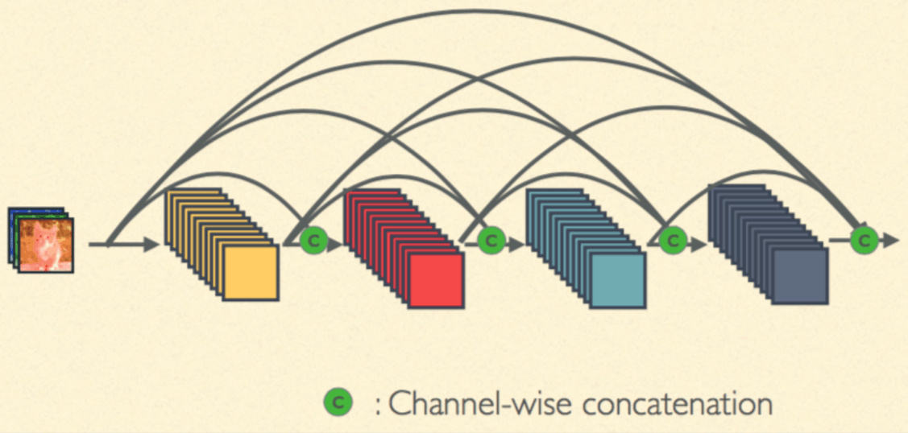
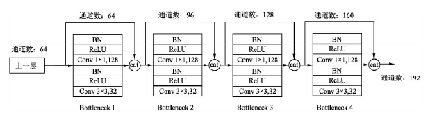
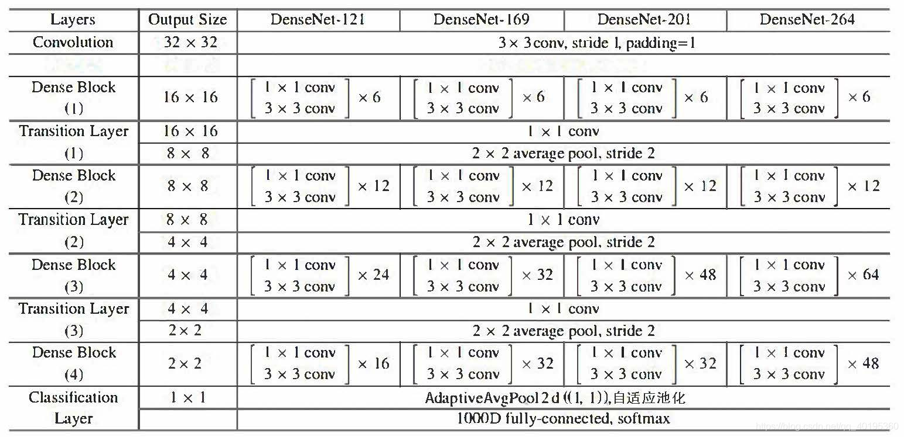

# Pytorch CIFAR10图像分类 DenseNet篇

[toc]

这里贴一下汇总篇：[汇总篇](https://blog.csdn.net/weixin_45508265/article/details/119285255)

## 4.定义网络（DenseNet）

之前的ResNet通过前层与后层的“短路连接”（Shortcuts），加强了前后层之间的信息流通，在一定程度上缓解了梯度消失现象，从而**可以将神经网络搭建得很深**。更进一步，DenseNet最大化了这种前后层信息交流，通过建立**前面所有层与后面层的密集连接**，实现了特征在通道维度上的复用，使其可以在参数与计算量更少的情况下实现比ResNet更优的性能。如果想详细了解并查看论文，可以看我的另一篇博客[【论文泛读】 DenseNet：稠密连接的卷积网络](https://blog.csdn.net/weixin_45508265/article/details/119181921)

DenseNet 和 ResNet 不同在于 ResNet 是跨层求和，而 DenseNet 是跨层将特征在通道维度进行拼接，下面可以看看他们两者的图示

这个是最标准的卷积神经网络


这是ResNet，是跨层求和


这个就是DenseNet，是跨层将特征在通道维度进行拼接


DenseNet的网络架构如下图所示，了便于下采样的实现，我们将网络划分为多个稠密连接的dense block，网络由多个Dense Block与中间的卷积池化组成，核心就在Dense Block中。Dense Block中的黑点代表一个卷积层，其中的多条黑线代表数据的流动，每一层的输入由前面的所有卷积层的输出组成。注意这里使用了通道拼接（Concatnate）操作，而非ResNet的逐元素相加操作。


我们将每个block之间的层称为过渡层，完成卷积和池化的操作。在我们的实验中，过渡层由BN层、1x1卷积层和2x2平均池化层组成。


具体的Block实现细节如下图所示，每一个Block由若干个Bottleneck的卷积层组成，对应上面图中的黑点。Bottleneck由BN、ReLU、1×1卷积、BN、ReLU、3×3卷积的顺序构成，也被称为DenseNet-B结构。其中1x1 Conv得到 4k 个特征图它起到的作用是降低特征数量，从而提升计算效率。


关于Block，有以下4个细节需要注意：

1. 每一个Bottleneck输出的特征通道数是相同的，例如这里的32。同时可以看到，经过Concatnate操作后的通道数是按32的增长量增加的，因此这个32也被称为GrowthRate。
2. 这里1×1卷积的作用是固定输出通道数，达到降维的作用。当几十个Bottleneck相连接时，Concatnate后的通道数会增加到上千，如果不增加1×1的卷积来降维，后续3×3卷积所需的参数量会急剧增加。1×1卷积的通道数通常是GrowthRate的4倍。
3. 上图中的特征传递方式是直接将前面所有层的特征Concatnate后传到下一层，这种方式与具体代码实现的方式是一致的。
4. Block采用了激活函数在前、卷积层在后的顺序，这与一般的网络上是不同的。


### DenseNet 的网络结构

在ImageNet数据集上的网络如下图所示


由于我是对CIFAR进行实验，而论文中给出的是ImageNet的网络模型，所以由于数据集的不同，模型稍微有些不同



首先我们还是得判断是否可以利用GPU，因为GPU的速度可能会比我们用CPU的速度快20-50倍左右，特别是对卷积神经网络来说，更是提升特别明显。

```python
device = 'cuda' if torch.cuda.is_available() else 'cpu'
```

### Bottleneck

```python
class Bottleneck(nn.Module):
    """
    Dense Block
    这里的growth_rate=out_channels, 就是每个Block自己输出的通道数。
    先通过1x1卷积层，将通道数缩小为4 * growth_rate，然后再通过3x3卷积层降低到growth_rate。
    """
    # 通常1×1卷积的通道数为GrowthRate的4倍
    expansion = 4
    
    def __init__(self, in_channels, growth_rate):
        super(Bottleneck, self).__init__()
        zip_channels = self.expansion * growth_rate
        self.features = nn.Sequential(
            nn.BatchNorm2d(in_channels),
            nn.ReLU(True),
            nn.Conv2d(in_channels, zip_channels, kernel_size=1, bias=False),
            nn.BatchNorm2d(zip_channels),
            nn.ReLU(True),
            nn.Conv2d(zip_channels, growth_rate, kernel_size=3, padding=1, bias=False)
        )
        
    def forward(self, x):
        out = self.features(x)
        out = torch.cat([out, x], 1)
        return out        
```

我们验证一下输出的 channel 是否正确

```python
test_net = Bottleneck(3, 5)
test_x = torch.zeros(1, 3, 32, 32)
print('input shape: {} x {} x {}'.format(test_x.shape[1], test_x.shape[2], test_x.shape[3]))
test_y = test_net(test_x)
print('output shape: {} x {} x {}'.format(test_y.shape[1], test_y.shape[2], test_y.shape[3]))
```

> ```python
> input shape: 3 x 32 x 32
> output shape: 8 x 32 x 32
> ```

### Transition

```python
class Transition(nn.Module):
    """
    改变维数的Transition层 具体包括BN、ReLU、1×1卷积（Conv）、2×2平均池化操作
    先通过1x1的卷积层减少channels，再通过2x2的平均池化层缩小feature-map
    """
    # 1×1卷积的作用是降维，起到压缩模型的作用，而平均池化则是降低特征图的尺寸。
    def __init__(self, in_channels, out_channels):
        super(Transition, self).__init__()
        self.features = nn.Sequential(
            nn.BatchNorm2d(in_channels),
            nn.ReLU(True),
            nn.Conv2d(in_channels, out_channels, kernel_size=1, bias=False),
            nn.AvgPool2d(2)
        )
        
    def forward(self, x):
        out = self.features(x)
        return out
```

验证一下过渡层是否正确

```python
test_net = Transition(3, 12)
test_x = torch.zeros(1, 3, 96, 96)
print('input shape: {} x {} x {}'.format(test_x.shape[1], test_x.shape[2], test_x.shape[3]))
test_y = test_net(test_x)
print('output shape: {} x {} x {}'.format(test_y.shape[1], test_y.shape[2], test_y.shape[3]))
```

> ```python
> input shape: 3 x 96 x 96
> output shape: 12 x 48 x 48
> ```

### DenseNet-BC

```python
# DesneNet-BC
# B 代表 bottleneck layer(BN-RELU-CONV(1x1)-BN-RELU-CONV(3x3))
# C 代表压缩系数(0<=theta<=1)
import math
class DenseNet(nn.Module):
    """
    Dense Net
    paper中growth_rate取12，维度压缩的参数θ，即reduction取0.5
    且初始化方法为kaiming_normal()
    num_blocks为每段网络中的DenseBlock数量
    DenseNet和ResNet一样也是六段式网络（一段卷积+四段Dense+平均池化层），最后FC层。
    第一段将维数从3变到2 * growth_rate
    
    (3, 32, 32) -> [Conv2d] -> (24, 32, 32) -> [layer1] -> (48, 16, 16) -> [layer2]
  ->(96, 8, 8) -> [layer3] -> (192, 4, 4) -> [layer4] -> (384, 4, 4) -> [AvgPool]
  ->(384, 1, 1) -> [Linear] -> (10)
    
    """
    def __init__(self, num_blocks, growth_rate=12, reduction=0.5, num_classes=10):
        super(DenseNet, self).__init__()
        self.growth_rate = growth_rate
        self.reduction = reduction
        
        num_channels = 2 * growth_rate
        
        self.features = nn.Conv2d(3, num_channels, kernel_size=3, padding=1, bias=False)
        self.layer1, num_channels = self._make_dense_layer(num_channels, num_blocks[0])
        self.layer2, num_channels = self._make_dense_layer(num_channels, num_blocks[1])
        self.layer3, num_channels = self._make_dense_layer(num_channels, num_blocks[2])
        self.layer4, num_channels = self._make_dense_layer(num_channels, num_blocks[3], transition=False)
        self.avg_pool = nn.Sequential(
            nn.BatchNorm2d(num_channels),
            nn.ReLU(True),
            nn.AvgPool2d(4),
        )
        self.classifier = nn.Linear(num_channels, num_classes)
        
        self._initialize_weight()
        
    def _make_dense_layer(self, in_channels, nblock, transition=True):
        layers = []
        for i in range(nblock):
            layers += [Bottleneck(in_channels, self.growth_rate)]
            in_channels += self.growth_rate
        out_channels = in_channels
        if transition:
            out_channels = int(math.floor(in_channels * self.reduction))
            layers += [Transition(in_channels, out_channels)]
        return nn.Sequential(*layers), out_channels
    
    def _initialize_weight(self):
        for m in self.modules():
            if isinstance(m, nn.Conv2d):
                nn.init.kaiming_normal_(m.weight.data)
                if m.bias is not None:
                    m.bias.data.zero_()
    
    def forward(self, x):
        out = self.features(x)
        out = self.layer1(out)
        out = self.layer2(out)
        out = self.layer3(out)
        out = self.layer4(out)
        out = self.avg_pool(out)
        out = out.view(out.size(0), -1)
        out = self.classifier(out)
        return out
```

```python
def DenseNet121():
    return DenseNet([6,12,24,16], growth_rate=32)

def DenseNet169():
    return DenseNet([6,12,32,32], growth_rate=32)

def DenseNet201():
    return DenseNet([6,12,48,32], growth_rate=32)

def DenseNet161():
    return DenseNet([6,12,36,24], growth_rate=48)

def densenet_cifar():
    return DenseNet([6,12,24,16], growth_rate=12)

net = DenseNet121().to(device)
```

```python
summary(net,(3,32,32))
```

> ```python
> ----------------------------------------------------------------
>         Layer (type)               Output Shape         Param #
> ================================================================
>             Conv2d-1           [-1, 64, 32, 32]           1,728
>        BatchNorm2d-2           [-1, 64, 32, 32]             128
>               ReLU-3           [-1, 64, 32, 32]               0
>             Conv2d-4          [-1, 128, 32, 32]           8,192
>        BatchNorm2d-5          [-1, 128, 32, 32]             256
>               ReLU-6          [-1, 128, 32, 32]               0
>             Conv2d-7           [-1, 32, 32, 32]          36,864
>         Bottleneck-8           [-1, 96, 32, 32]               0
>        BatchNorm2d-9           [-1, 96, 32, 32]             192
>              ReLU-10           [-1, 96, 32, 32]               0
>            Conv2d-11          [-1, 128, 32, 32]          12,288
>       BatchNorm2d-12          [-1, 128, 32, 32]             256
>              ReLU-13          [-1, 128, 32, 32]               0
>            Conv2d-14           [-1, 32, 32, 32]          36,864
>        Bottleneck-15          [-1, 128, 32, 32]               0
>       BatchNorm2d-16          [-1, 128, 32, 32]             256
>              ReLU-17          [-1, 128, 32, 32]               0
>            Conv2d-18          [-1, 128, 32, 32]          16,384
>       BatchNorm2d-19          [-1, 128, 32, 32]             256
>              ReLU-20          [-1, 128, 32, 32]               0
>            Conv2d-21           [-1, 32, 32, 32]          36,864
>        Bottleneck-22          [-1, 160, 32, 32]               0
>       BatchNorm2d-23          [-1, 160, 32, 32]             320
>              ReLU-24          [-1, 160, 32, 32]               0
>            Conv2d-25          [-1, 128, 32, 32]          20,480
>       BatchNorm2d-26          [-1, 128, 32, 32]             256
>              ReLU-27          [-1, 128, 32, 32]               0
>            Conv2d-28           [-1, 32, 32, 32]          36,864
>        Bottleneck-29          [-1, 192, 32, 32]               0
>       BatchNorm2d-30          [-1, 192, 32, 32]             384
>              ReLU-31          [-1, 192, 32, 32]               0
>            Conv2d-32          [-1, 128, 32, 32]          24,576
>       BatchNorm2d-33          [-1, 128, 32, 32]             256
>              ReLU-34          [-1, 128, 32, 32]               0
>            Conv2d-35           [-1, 32, 32, 32]          36,864
>        Bottleneck-36          [-1, 224, 32, 32]               0
>       BatchNorm2d-37          [-1, 224, 32, 32]             448
>              ReLU-38          [-1, 224, 32, 32]               0
>            Conv2d-39          [-1, 128, 32, 32]          28,672
>       BatchNorm2d-40          [-1, 128, 32, 32]             256
>              ReLU-41          [-1, 128, 32, 32]               0
>            Conv2d-42           [-1, 32, 32, 32]          36,864
>        Bottleneck-43          [-1, 256, 32, 32]               0
>       BatchNorm2d-44          [-1, 256, 32, 32]             512
>              ReLU-45          [-1, 256, 32, 32]               0
>            Conv2d-46          [-1, 128, 32, 32]          32,768
>         AvgPool2d-47          [-1, 128, 16, 16]               0
>        Transition-48          [-1, 128, 16, 16]               0
>       BatchNorm2d-49          [-1, 128, 16, 16]             256
>              ReLU-50          [-1, 128, 16, 16]               0
>            Conv2d-51          [-1, 128, 16, 16]          16,384
>       BatchNorm2d-52          [-1, 128, 16, 16]             256
>              ReLU-53          [-1, 128, 16, 16]               0
>            Conv2d-54           [-1, 32, 16, 16]          36,864
>        Bottleneck-55          [-1, 160, 16, 16]               0
>       BatchNorm2d-56          [-1, 160, 16, 16]             320
>              ReLU-57          [-1, 160, 16, 16]               0
>            Conv2d-58          [-1, 128, 16, 16]          20,480
>       BatchNorm2d-59          [-1, 128, 16, 16]             256
>              ReLU-60          [-1, 128, 16, 16]               0
>            Conv2d-61           [-1, 32, 16, 16]          36,864
>        Bottleneck-62          [-1, 192, 16, 16]               0
>       BatchNorm2d-63          [-1, 192, 16, 16]             384
>              ReLU-64          [-1, 192, 16, 16]               0
>            Conv2d-65          [-1, 128, 16, 16]          24,576
>       BatchNorm2d-66          [-1, 128, 16, 16]             256
>              ReLU-67          [-1, 128, 16, 16]               0
>            Conv2d-68           [-1, 32, 16, 16]          36,864
>        Bottleneck-69          [-1, 224, 16, 16]               0
>       BatchNorm2d-70          [-1, 224, 16, 16]             448
>              ReLU-71          [-1, 224, 16, 16]               0
>            Conv2d-72          [-1, 128, 16, 16]          28,672
>       BatchNorm2d-73          [-1, 128, 16, 16]             256
>              ReLU-74          [-1, 128, 16, 16]               0
>            Conv2d-75           [-1, 32, 16, 16]          36,864
>        Bottleneck-76          [-1, 256, 16, 16]               0
>       BatchNorm2d-77          [-1, 256, 16, 16]             512
>              ReLU-78          [-1, 256, 16, 16]               0
>            Conv2d-79          [-1, 128, 16, 16]          32,768
>       BatchNorm2d-80          [-1, 128, 16, 16]             256
>              ReLU-81          [-1, 128, 16, 16]               0
>            Conv2d-82           [-1, 32, 16, 16]          36,864
>        Bottleneck-83          [-1, 288, 16, 16]               0
>       BatchNorm2d-84          [-1, 288, 16, 16]             576
>              ReLU-85          [-1, 288, 16, 16]               0
>            Conv2d-86          [-1, 128, 16, 16]          36,864
>       BatchNorm2d-87          [-1, 128, 16, 16]             256
>              ReLU-88          [-1, 128, 16, 16]               0
>            Conv2d-89           [-1, 32, 16, 16]          36,864
>        Bottleneck-90          [-1, 320, 16, 16]               0
>       BatchNorm2d-91          [-1, 320, 16, 16]             640
>              ReLU-92          [-1, 320, 16, 16]               0
>            Conv2d-93          [-1, 128, 16, 16]          40,960
>       BatchNorm2d-94          [-1, 128, 16, 16]             256
>              ReLU-95          [-1, 128, 16, 16]               0
>            Conv2d-96           [-1, 32, 16, 16]          36,864
>        Bottleneck-97          [-1, 352, 16, 16]               0
>       BatchNorm2d-98          [-1, 352, 16, 16]             704
>              ReLU-99          [-1, 352, 16, 16]               0
>           Conv2d-100          [-1, 128, 16, 16]          45,056
>      BatchNorm2d-101          [-1, 128, 16, 16]             256
>             ReLU-102          [-1, 128, 16, 16]               0
>           Conv2d-103           [-1, 32, 16, 16]          36,864
>       Bottleneck-104          [-1, 384, 16, 16]               0
>      BatchNorm2d-105          [-1, 384, 16, 16]             768
>             ReLU-106          [-1, 384, 16, 16]               0
>           Conv2d-107          [-1, 128, 16, 16]          49,152
>      BatchNorm2d-108          [-1, 128, 16, 16]             256
>             ReLU-109          [-1, 128, 16, 16]               0
>           Conv2d-110           [-1, 32, 16, 16]          36,864
>       Bottleneck-111          [-1, 416, 16, 16]               0
>      BatchNorm2d-112          [-1, 416, 16, 16]             832
>             ReLU-113          [-1, 416, 16, 16]               0
>           Conv2d-114          [-1, 128, 16, 16]          53,248
>      BatchNorm2d-115          [-1, 128, 16, 16]             256
>             ReLU-116          [-1, 128, 16, 16]               0
>           Conv2d-117           [-1, 32, 16, 16]          36,864
>       Bottleneck-118          [-1, 448, 16, 16]               0
>      BatchNorm2d-119          [-1, 448, 16, 16]             896
>             ReLU-120          [-1, 448, 16, 16]               0
>           Conv2d-121          [-1, 128, 16, 16]          57,344
>      BatchNorm2d-122          [-1, 128, 16, 16]             256
>             ReLU-123          [-1, 128, 16, 16]               0
>           Conv2d-124           [-1, 32, 16, 16]          36,864
>       Bottleneck-125          [-1, 480, 16, 16]               0
>      BatchNorm2d-126          [-1, 480, 16, 16]             960
>             ReLU-127          [-1, 480, 16, 16]               0
>           Conv2d-128          [-1, 128, 16, 16]          61,440
>      BatchNorm2d-129          [-1, 128, 16, 16]             256
>             ReLU-130          [-1, 128, 16, 16]               0
>           Conv2d-131           [-1, 32, 16, 16]          36,864
>       Bottleneck-132          [-1, 512, 16, 16]               0
>      BatchNorm2d-133          [-1, 512, 16, 16]           1,024
>             ReLU-134          [-1, 512, 16, 16]               0
>           Conv2d-135          [-1, 256, 16, 16]         131,072
>        AvgPool2d-136            [-1, 256, 8, 8]               0
>       Transition-137            [-1, 256, 8, 8]               0
>      BatchNorm2d-138            [-1, 256, 8, 8]             512
>             ReLU-139            [-1, 256, 8, 8]               0
>           Conv2d-140            [-1, 128, 8, 8]          32,768
>      BatchNorm2d-141            [-1, 128, 8, 8]             256
>             ReLU-142            [-1, 128, 8, 8]               0
>           Conv2d-143             [-1, 32, 8, 8]          36,864
>       Bottleneck-144            [-1, 288, 8, 8]               0
>      BatchNorm2d-145            [-1, 288, 8, 8]             576
>             ReLU-146            [-1, 288, 8, 8]               0
>           Conv2d-147            [-1, 128, 8, 8]          36,864
>      BatchNorm2d-148            [-1, 128, 8, 8]             256
>             ReLU-149            [-1, 128, 8, 8]               0
>           Conv2d-150             [-1, 32, 8, 8]          36,864
>       Bottleneck-151            [-1, 320, 8, 8]               0
>      BatchNorm2d-152            [-1, 320, 8, 8]             640
>             ReLU-153            [-1, 320, 8, 8]               0
>           Conv2d-154            [-1, 128, 8, 8]          40,960
>      BatchNorm2d-155            [-1, 128, 8, 8]             256
>             ReLU-156            [-1, 128, 8, 8]               0
>           Conv2d-157             [-1, 32, 8, 8]          36,864
>       Bottleneck-158            [-1, 352, 8, 8]               0
>      BatchNorm2d-159            [-1, 352, 8, 8]             704
>             ReLU-160            [-1, 352, 8, 8]               0
>           Conv2d-161            [-1, 128, 8, 8]          45,056
>      BatchNorm2d-162            [-1, 128, 8, 8]             256
>             ReLU-163            [-1, 128, 8, 8]               0
>           Conv2d-164             [-1, 32, 8, 8]          36,864
>       Bottleneck-165            [-1, 384, 8, 8]               0
>      BatchNorm2d-166            [-1, 384, 8, 8]             768
>             ReLU-167            [-1, 384, 8, 8]               0
>           Conv2d-168            [-1, 128, 8, 8]          49,152
>      BatchNorm2d-169            [-1, 128, 8, 8]             256
>             ReLU-170            [-1, 128, 8, 8]               0
>           Conv2d-171             [-1, 32, 8, 8]          36,864
>       Bottleneck-172            [-1, 416, 8, 8]               0
>      BatchNorm2d-173            [-1, 416, 8, 8]             832
>             ReLU-174            [-1, 416, 8, 8]               0
>           Conv2d-175            [-1, 128, 8, 8]          53,248
>      BatchNorm2d-176            [-1, 128, 8, 8]             256
>             ReLU-177            [-1, 128, 8, 8]               0
>           Conv2d-178             [-1, 32, 8, 8]          36,864
>       Bottleneck-179            [-1, 448, 8, 8]               0
>      BatchNorm2d-180            [-1, 448, 8, 8]             896
>             ReLU-181            [-1, 448, 8, 8]               0
>           Conv2d-182            [-1, 128, 8, 8]          57,344
>      BatchNorm2d-183            [-1, 128, 8, 8]             256
>             ReLU-184            [-1, 128, 8, 8]               0
>           Conv2d-185             [-1, 32, 8, 8]          36,864
>       Bottleneck-186            [-1, 480, 8, 8]               0
>      BatchNorm2d-187            [-1, 480, 8, 8]             960
>             ReLU-188            [-1, 480, 8, 8]               0
>           Conv2d-189            [-1, 128, 8, 8]          61,440
>      BatchNorm2d-190            [-1, 128, 8, 8]             256
>             ReLU-191            [-1, 128, 8, 8]               0
>           Conv2d-192             [-1, 32, 8, 8]          36,864
>       Bottleneck-193            [-1, 512, 8, 8]               0
>      BatchNorm2d-194            [-1, 512, 8, 8]           1,024
>             ReLU-195            [-1, 512, 8, 8]               0
>           Conv2d-196            [-1, 128, 8, 8]          65,536
>      BatchNorm2d-197            [-1, 128, 8, 8]             256
>             ReLU-198            [-1, 128, 8, 8]               0
>           Conv2d-199             [-1, 32, 8, 8]          36,864
>       Bottleneck-200            [-1, 544, 8, 8]               0
>      BatchNorm2d-201            [-1, 544, 8, 8]           1,088
>             ReLU-202            [-1, 544, 8, 8]               0
>           Conv2d-203            [-1, 128, 8, 8]          69,632
>      BatchNorm2d-204            [-1, 128, 8, 8]             256
>             ReLU-205            [-1, 128, 8, 8]               0
>           Conv2d-206             [-1, 32, 8, 8]          36,864
>       Bottleneck-207            [-1, 576, 8, 8]               0
>      BatchNorm2d-208            [-1, 576, 8, 8]           1,152
>             ReLU-209            [-1, 576, 8, 8]               0
>           Conv2d-210            [-1, 128, 8, 8]          73,728
>      BatchNorm2d-211            [-1, 128, 8, 8]             256
>             ReLU-212            [-1, 128, 8, 8]               0
>           Conv2d-213             [-1, 32, 8, 8]          36,864
>       Bottleneck-214            [-1, 608, 8, 8]               0
>      BatchNorm2d-215            [-1, 608, 8, 8]           1,216
>             ReLU-216            [-1, 608, 8, 8]               0
>           Conv2d-217            [-1, 128, 8, 8]          77,824
>      BatchNorm2d-218            [-1, 128, 8, 8]             256
>             ReLU-219            [-1, 128, 8, 8]               0
>           Conv2d-220             [-1, 32, 8, 8]          36,864
>       Bottleneck-221            [-1, 640, 8, 8]               0
>      BatchNorm2d-222            [-1, 640, 8, 8]           1,280
>             ReLU-223            [-1, 640, 8, 8]               0
>           Conv2d-224            [-1, 128, 8, 8]          81,920
>      BatchNorm2d-225            [-1, 128, 8, 8]             256
>             ReLU-226            [-1, 128, 8, 8]               0
>           Conv2d-227             [-1, 32, 8, 8]          36,864
>       Bottleneck-228            [-1, 672, 8, 8]               0
>      BatchNorm2d-229            [-1, 672, 8, 8]           1,344
>             ReLU-230            [-1, 672, 8, 8]               0
>           Conv2d-231            [-1, 128, 8, 8]          86,016
>      BatchNorm2d-232            [-1, 128, 8, 8]             256
>             ReLU-233            [-1, 128, 8, 8]               0
>           Conv2d-234             [-1, 32, 8, 8]          36,864
>       Bottleneck-235            [-1, 704, 8, 8]               0
>      BatchNorm2d-236            [-1, 704, 8, 8]           1,408
>             ReLU-237            [-1, 704, 8, 8]               0
>           Conv2d-238            [-1, 128, 8, 8]          90,112
>      BatchNorm2d-239            [-1, 128, 8, 8]             256
>             ReLU-240            [-1, 128, 8, 8]               0
>           Conv2d-241             [-1, 32, 8, 8]          36,864
>       Bottleneck-242            [-1, 736, 8, 8]               0
>      BatchNorm2d-243            [-1, 736, 8, 8]           1,472
>             ReLU-244            [-1, 736, 8, 8]               0
>           Conv2d-245            [-1, 128, 8, 8]          94,208
>      BatchNorm2d-246            [-1, 128, 8, 8]             256
>             ReLU-247            [-1, 128, 8, 8]               0
>           Conv2d-248             [-1, 32, 8, 8]          36,864
>       Bottleneck-249            [-1, 768, 8, 8]               0
>      BatchNorm2d-250            [-1, 768, 8, 8]           1,536
>             ReLU-251            [-1, 768, 8, 8]               0
>           Conv2d-252            [-1, 128, 8, 8]          98,304
>      BatchNorm2d-253            [-1, 128, 8, 8]             256
>             ReLU-254            [-1, 128, 8, 8]               0
>           Conv2d-255             [-1, 32, 8, 8]          36,864
>       Bottleneck-256            [-1, 800, 8, 8]               0
>      BatchNorm2d-257            [-1, 800, 8, 8]           1,600
>             ReLU-258            [-1, 800, 8, 8]               0
>           Conv2d-259            [-1, 128, 8, 8]         102,400
>      BatchNorm2d-260            [-1, 128, 8, 8]             256
>             ReLU-261            [-1, 128, 8, 8]               0
>           Conv2d-262             [-1, 32, 8, 8]          36,864
>       Bottleneck-263            [-1, 832, 8, 8]               0
>      BatchNorm2d-264            [-1, 832, 8, 8]           1,664
>             ReLU-265            [-1, 832, 8, 8]               0
>           Conv2d-266            [-1, 128, 8, 8]         106,496
>      BatchNorm2d-267            [-1, 128, 8, 8]             256
>             ReLU-268            [-1, 128, 8, 8]               0
>           Conv2d-269             [-1, 32, 8, 8]          36,864
>       Bottleneck-270            [-1, 864, 8, 8]               0
>      BatchNorm2d-271            [-1, 864, 8, 8]           1,728
>             ReLU-272            [-1, 864, 8, 8]               0
>           Conv2d-273            [-1, 128, 8, 8]         110,592
>      BatchNorm2d-274            [-1, 128, 8, 8]             256
>             ReLU-275            [-1, 128, 8, 8]               0
>           Conv2d-276             [-1, 32, 8, 8]          36,864
>       Bottleneck-277            [-1, 896, 8, 8]               0
>      BatchNorm2d-278            [-1, 896, 8, 8]           1,792
>             ReLU-279            [-1, 896, 8, 8]               0
>           Conv2d-280            [-1, 128, 8, 8]         114,688
>      BatchNorm2d-281            [-1, 128, 8, 8]             256
>             ReLU-282            [-1, 128, 8, 8]               0
>           Conv2d-283             [-1, 32, 8, 8]          36,864
>       Bottleneck-284            [-1, 928, 8, 8]               0
>      BatchNorm2d-285            [-1, 928, 8, 8]           1,856
>             ReLU-286            [-1, 928, 8, 8]               0
>           Conv2d-287            [-1, 128, 8, 8]         118,784
>      BatchNorm2d-288            [-1, 128, 8, 8]             256
>             ReLU-289            [-1, 128, 8, 8]               0
>           Conv2d-290             [-1, 32, 8, 8]          36,864
>       Bottleneck-291            [-1, 960, 8, 8]               0
>      BatchNorm2d-292            [-1, 960, 8, 8]           1,920
>             ReLU-293            [-1, 960, 8, 8]               0
>           Conv2d-294            [-1, 128, 8, 8]         122,880
>      BatchNorm2d-295            [-1, 128, 8, 8]             256
>             ReLU-296            [-1, 128, 8, 8]               0
>           Conv2d-297             [-1, 32, 8, 8]          36,864
>       Bottleneck-298            [-1, 992, 8, 8]               0
>      BatchNorm2d-299            [-1, 992, 8, 8]           1,984
>             ReLU-300            [-1, 992, 8, 8]               0
>           Conv2d-301            [-1, 128, 8, 8]         126,976
>      BatchNorm2d-302            [-1, 128, 8, 8]             256
>             ReLU-303            [-1, 128, 8, 8]               0
>           Conv2d-304             [-1, 32, 8, 8]          36,864
>       Bottleneck-305           [-1, 1024, 8, 8]               0
>      BatchNorm2d-306           [-1, 1024, 8, 8]           2,048
>             ReLU-307           [-1, 1024, 8, 8]               0
>           Conv2d-308            [-1, 512, 8, 8]         524,288
>        AvgPool2d-309            [-1, 512, 4, 4]               0
>       Transition-310            [-1, 512, 4, 4]               0
>      BatchNorm2d-311            [-1, 512, 4, 4]           1,024
>             ReLU-312            [-1, 512, 4, 4]               0
>           Conv2d-313            [-1, 128, 4, 4]          65,536
>      BatchNorm2d-314            [-1, 128, 4, 4]             256
>             ReLU-315            [-1, 128, 4, 4]               0
>           Conv2d-316             [-1, 32, 4, 4]          36,864
>       Bottleneck-317            [-1, 544, 4, 4]               0
>      BatchNorm2d-318            [-1, 544, 4, 4]           1,088
>             ReLU-319            [-1, 544, 4, 4]               0
>           Conv2d-320            [-1, 128, 4, 4]          69,632
>      BatchNorm2d-321            [-1, 128, 4, 4]             256
>             ReLU-322            [-1, 128, 4, 4]               0
>           Conv2d-323             [-1, 32, 4, 4]          36,864
>       Bottleneck-324            [-1, 576, 4, 4]               0
>      BatchNorm2d-325            [-1, 576, 4, 4]           1,152
>             ReLU-326            [-1, 576, 4, 4]               0
>           Conv2d-327            [-1, 128, 4, 4]          73,728
>      BatchNorm2d-328            [-1, 128, 4, 4]             256
>             ReLU-329            [-1, 128, 4, 4]               0
>           Conv2d-330             [-1, 32, 4, 4]          36,864
>       Bottleneck-331            [-1, 608, 4, 4]               0
>      BatchNorm2d-332            [-1, 608, 4, 4]           1,216
>             ReLU-333            [-1, 608, 4, 4]               0
>           Conv2d-334            [-1, 128, 4, 4]          77,824
>      BatchNorm2d-335            [-1, 128, 4, 4]             256
>             ReLU-336            [-1, 128, 4, 4]               0
>           Conv2d-337             [-1, 32, 4, 4]          36,864
>       Bottleneck-338            [-1, 640, 4, 4]               0
>      BatchNorm2d-339            [-1, 640, 4, 4]           1,280
>             ReLU-340            [-1, 640, 4, 4]               0
>           Conv2d-341            [-1, 128, 4, 4]          81,920
>      BatchNorm2d-342            [-1, 128, 4, 4]             256
>             ReLU-343            [-1, 128, 4, 4]               0
>           Conv2d-344             [-1, 32, 4, 4]          36,864
>       Bottleneck-345            [-1, 672, 4, 4]               0
>      BatchNorm2d-346            [-1, 672, 4, 4]           1,344
>             ReLU-347            [-1, 672, 4, 4]               0
>           Conv2d-348            [-1, 128, 4, 4]          86,016
>      BatchNorm2d-349            [-1, 128, 4, 4]             256
>             ReLU-350            [-1, 128, 4, 4]               0
>           Conv2d-351             [-1, 32, 4, 4]          36,864
>       Bottleneck-352            [-1, 704, 4, 4]               0
>      BatchNorm2d-353            [-1, 704, 4, 4]           1,408
>             ReLU-354            [-1, 704, 4, 4]               0
>           Conv2d-355            [-1, 128, 4, 4]          90,112
>      BatchNorm2d-356            [-1, 128, 4, 4]             256
>             ReLU-357            [-1, 128, 4, 4]               0
>           Conv2d-358             [-1, 32, 4, 4]          36,864
>       Bottleneck-359            [-1, 736, 4, 4]               0
>      BatchNorm2d-360            [-1, 736, 4, 4]           1,472
>             ReLU-361            [-1, 736, 4, 4]               0
>           Conv2d-362            [-1, 128, 4, 4]          94,208
>      BatchNorm2d-363            [-1, 128, 4, 4]             256
>             ReLU-364            [-1, 128, 4, 4]               0
>           Conv2d-365             [-1, 32, 4, 4]          36,864
>       Bottleneck-366            [-1, 768, 4, 4]               0
>      BatchNorm2d-367            [-1, 768, 4, 4]           1,536
>             ReLU-368            [-1, 768, 4, 4]               0
>           Conv2d-369            [-1, 128, 4, 4]          98,304
>      BatchNorm2d-370            [-1, 128, 4, 4]             256
>             ReLU-371            [-1, 128, 4, 4]               0
>           Conv2d-372             [-1, 32, 4, 4]          36,864
>       Bottleneck-373            [-1, 800, 4, 4]               0
>      BatchNorm2d-374            [-1, 800, 4, 4]           1,600
>             ReLU-375            [-1, 800, 4, 4]               0
>           Conv2d-376            [-1, 128, 4, 4]         102,400
>      BatchNorm2d-377            [-1, 128, 4, 4]             256
>             ReLU-378            [-1, 128, 4, 4]               0
>           Conv2d-379             [-1, 32, 4, 4]          36,864
>       Bottleneck-380            [-1, 832, 4, 4]               0
>      BatchNorm2d-381            [-1, 832, 4, 4]           1,664
>             ReLU-382            [-1, 832, 4, 4]               0
>           Conv2d-383            [-1, 128, 4, 4]         106,496
>      BatchNorm2d-384            [-1, 128, 4, 4]             256
>             ReLU-385            [-1, 128, 4, 4]               0
>           Conv2d-386             [-1, 32, 4, 4]          36,864
>       Bottleneck-387            [-1, 864, 4, 4]               0
>      BatchNorm2d-388            [-1, 864, 4, 4]           1,728
>             ReLU-389            [-1, 864, 4, 4]               0
>           Conv2d-390            [-1, 128, 4, 4]         110,592
>      BatchNorm2d-391            [-1, 128, 4, 4]             256
>             ReLU-392            [-1, 128, 4, 4]               0
>           Conv2d-393             [-1, 32, 4, 4]          36,864
>       Bottleneck-394            [-1, 896, 4, 4]               0
>      BatchNorm2d-395            [-1, 896, 4, 4]           1,792
>             ReLU-396            [-1, 896, 4, 4]               0
>           Conv2d-397            [-1, 128, 4, 4]         114,688
>      BatchNorm2d-398            [-1, 128, 4, 4]             256
>             ReLU-399            [-1, 128, 4, 4]               0
>           Conv2d-400             [-1, 32, 4, 4]          36,864
>       Bottleneck-401            [-1, 928, 4, 4]               0
>      BatchNorm2d-402            [-1, 928, 4, 4]           1,856
>             ReLU-403            [-1, 928, 4, 4]               0
>           Conv2d-404            [-1, 128, 4, 4]         118,784
>      BatchNorm2d-405            [-1, 128, 4, 4]             256
>             ReLU-406            [-1, 128, 4, 4]               0
>           Conv2d-407             [-1, 32, 4, 4]          36,864
>       Bottleneck-408            [-1, 960, 4, 4]               0
>      BatchNorm2d-409            [-1, 960, 4, 4]           1,920
>             ReLU-410            [-1, 960, 4, 4]               0
>           Conv2d-411            [-1, 128, 4, 4]         122,880
>      BatchNorm2d-412            [-1, 128, 4, 4]             256
>             ReLU-413            [-1, 128, 4, 4]               0
>           Conv2d-414             [-1, 32, 4, 4]          36,864
>       Bottleneck-415            [-1, 992, 4, 4]               0
>      BatchNorm2d-416            [-1, 992, 4, 4]           1,984
>             ReLU-417            [-1, 992, 4, 4]               0
>           Conv2d-418            [-1, 128, 4, 4]         126,976
>      BatchNorm2d-419            [-1, 128, 4, 4]             256
>             ReLU-420            [-1, 128, 4, 4]               0
>           Conv2d-421             [-1, 32, 4, 4]          36,864
>       Bottleneck-422           [-1, 1024, 4, 4]               0
>      BatchNorm2d-423           [-1, 1024, 4, 4]           2,048
>             ReLU-424           [-1, 1024, 4, 4]               0
>        AvgPool2d-425           [-1, 1024, 1, 1]               0
>           Linear-426                   [-1, 10]          10,250
> ================================================================
> Total params: 6,956,298
> Trainable params: 6,956,298
> Non-trainable params: 0
> ----------------------------------------------------------------
> Input size (MB): 0.01
> Forward/backward pass size (MB): 115.98
> Params size (MB): 26.54
> Estimated Total Size (MB): 142.52
> ----------------------------------------------------------------
> ```

首先从我们summary可以看到，我们定义的模型的参数大概是6 millions，我们输入的是（batch，3，32，32）的张量，并且这里也能看到每一层后我们的图像输出大小的变化，最后输出10个参数，再通过softmax函数就可以得到我们每个类别的概率了。

我们也可以打印出我们的模型观察一下

```python
DenseNet(
  (features): Conv2d(3, 64, kernel_size=(3, 3), stride=(1, 1), padding=(1, 1), bias=False)
  (layer1): Sequential(
    (0): Bottleneck(
      (features): Sequential(
        (0): BatchNorm2d(64, eps=1e-05, momentum=0.1, affine=True, track_running_stats=True)
        (1): ReLU(inplace=True)
        (2): Conv2d(64, 128, kernel_size=(1, 1), stride=(1, 1), bias=False)
        (3): BatchNorm2d(128, eps=1e-05, momentum=0.1, affine=True, track_running_stats=True)
        (4): ReLU(inplace=True)
        (5): Conv2d(128, 32, kernel_size=(3, 3), stride=(1, 1), padding=(1, 1), bias=False)
      )
    )
    (1): Bottleneck(
      (features): Sequential(
        (0): BatchNorm2d(96, eps=1e-05, momentum=0.1, affine=True, track_running_stats=True)
        (1): ReLU(inplace=True)
        (2): Conv2d(96, 128, kernel_size=(1, 1), stride=(1, 1), bias=False)
        (3): BatchNorm2d(128, eps=1e-05, momentum=0.1, affine=True, track_running_stats=True)
        (4): ReLU(inplace=True)
        (5): Conv2d(128, 32, kernel_size=(3, 3), stride=(1, 1), padding=(1, 1), bias=False)
      )
    )
    (2): Bottleneck(
      (features): Sequential(
        (0): BatchNorm2d(128, eps=1e-05, momentum=0.1, affine=True, track_running_stats=True)
        (1): ReLU(inplace=True)
        (2): Conv2d(128, 128, kernel_size=(1, 1), stride=(1, 1), bias=False)
        (3): BatchNorm2d(128, eps=1e-05, momentum=0.1, affine=True, track_running_stats=True)
        (4): ReLU(inplace=True)
        (5): Conv2d(128, 32, kernel_size=(3, 3), stride=(1, 1), padding=(1, 1), bias=False)
      )
    )
    (3): Bottleneck(
      (features): Sequential(
        (0): BatchNorm2d(160, eps=1e-05, momentum=0.1, affine=True, track_running_stats=True)
        (1): ReLU(inplace=True)
        (2): Conv2d(160, 128, kernel_size=(1, 1), stride=(1, 1), bias=False)
        (3): BatchNorm2d(128, eps=1e-05, momentum=0.1, affine=True, track_running_stats=True)
        (4): ReLU(inplace=True)
        (5): Conv2d(128, 32, kernel_size=(3, 3), stride=(1, 1), padding=(1, 1), bias=False)
      )
    )
    (4): Bottleneck(
      (features): Sequential(
        (0): BatchNorm2d(192, eps=1e-05, momentum=0.1, affine=True, track_running_stats=True)
        (1): ReLU(inplace=True)
        (2): Conv2d(192, 128, kernel_size=(1, 1), stride=(1, 1), bias=False)
        (3): BatchNorm2d(128, eps=1e-05, momentum=0.1, affine=True, track_running_stats=True)
        (4): ReLU(inplace=True)
        (5): Conv2d(128, 32, kernel_size=(3, 3), stride=(1, 1), padding=(1, 1), bias=False)
      )
    )
    (5): Bottleneck(
      (features): Sequential(
        (0): BatchNorm2d(224, eps=1e-05, momentum=0.1, affine=True, track_running_stats=True)
        (1): ReLU(inplace=True)
        (2): Conv2d(224, 128, kernel_size=(1, 1), stride=(1, 1), bias=False)
        (3): BatchNorm2d(128, eps=1e-05, momentum=0.1, affine=True, track_running_stats=True)
        (4): ReLU(inplace=True)
        (5): Conv2d(128, 32, kernel_size=(3, 3), stride=(1, 1), padding=(1, 1), bias=False)
      )
    )
    (6): Transition(
      (features): Sequential(
        (0): BatchNorm2d(256, eps=1e-05, momentum=0.1, affine=True, track_running_stats=True)
        (1): ReLU(inplace=True)
        (2): Conv2d(256, 128, kernel_size=(1, 1), stride=(1, 1), bias=False)
        (3): AvgPool2d(kernel_size=2, stride=2, padding=0)
      )
    )
  )
  (layer2): Sequential(
    (0): Bottleneck(
      (features): Sequential(
        (0): BatchNorm2d(128, eps=1e-05, momentum=0.1, affine=True, track_running_stats=True)
        (1): ReLU(inplace=True)
        (2): Conv2d(128, 128, kernel_size=(1, 1), stride=(1, 1), bias=False)
        (3): BatchNorm2d(128, eps=1e-05, momentum=0.1, affine=True, track_running_stats=True)
        (4): ReLU(inplace=True)
        (5): Conv2d(128, 32, kernel_size=(3, 3), stride=(1, 1), padding=(1, 1), bias=False)
      )
    )
    (1): Bottleneck(
      (features): Sequential(
        (0): BatchNorm2d(160, eps=1e-05, momentum=0.1, affine=True, track_running_stats=True)
        (1): ReLU(inplace=True)
        (2): Conv2d(160, 128, kernel_size=(1, 1), stride=(1, 1), bias=False)
        (3): BatchNorm2d(128, eps=1e-05, momentum=0.1, affine=True, track_running_stats=True)
        (4): ReLU(inplace=True)
        (5): Conv2d(128, 32, kernel_size=(3, 3), stride=(1, 1), padding=(1, 1), bias=False)
      )
    )
    (2): Bottleneck(
      (features): Sequential(
        (0): BatchNorm2d(192, eps=1e-05, momentum=0.1, affine=True, track_running_stats=True)
        (1): ReLU(inplace=True)
        (2): Conv2d(192, 128, kernel_size=(1, 1), stride=(1, 1), bias=False)
        (3): BatchNorm2d(128, eps=1e-05, momentum=0.1, affine=True, track_running_stats=True)
        (4): ReLU(inplace=True)
        (5): Conv2d(128, 32, kernel_size=(3, 3), stride=(1, 1), padding=(1, 1), bias=False)
      )
    )
    (3): Bottleneck(
      (features): Sequential(
        (0): BatchNorm2d(224, eps=1e-05, momentum=0.1, affine=True, track_running_stats=True)
        (1): ReLU(inplace=True)
        (2): Conv2d(224, 128, kernel_size=(1, 1), stride=(1, 1), bias=False)
        (3): BatchNorm2d(128, eps=1e-05, momentum=0.1, affine=True, track_running_stats=True)
        (4): ReLU(inplace=True)
        (5): Conv2d(128, 32, kernel_size=(3, 3), stride=(1, 1), padding=(1, 1), bias=False)
      )
    )
    (4): Bottleneck(
      (features): Sequential(
        (0): BatchNorm2d(256, eps=1e-05, momentum=0.1, affine=True, track_running_stats=True)
        (1): ReLU(inplace=True)
        (2): Conv2d(256, 128, kernel_size=(1, 1), stride=(1, 1), bias=False)
        (3): BatchNorm2d(128, eps=1e-05, momentum=0.1, affine=True, track_running_stats=True)
        (4): ReLU(inplace=True)
        (5): Conv2d(128, 32, kernel_size=(3, 3), stride=(1, 1), padding=(1, 1), bias=False)
      )
    )
    (5): Bottleneck(
      (features): Sequential(
        (0): BatchNorm2d(288, eps=1e-05, momentum=0.1, affine=True, track_running_stats=True)
        (1): ReLU(inplace=True)
        (2): Conv2d(288, 128, kernel_size=(1, 1), stride=(1, 1), bias=False)
        (3): BatchNorm2d(128, eps=1e-05, momentum=0.1, affine=True, track_running_stats=True)
        (4): ReLU(inplace=True)
        (5): Conv2d(128, 32, kernel_size=(3, 3), stride=(1, 1), padding=(1, 1), bias=False)
      )
    )
    (6): Bottleneck(
      (features): Sequential(
        (0): BatchNorm2d(320, eps=1e-05, momentum=0.1, affine=True, track_running_stats=True)
        (1): ReLU(inplace=True)
        (2): Conv2d(320, 128, kernel_size=(1, 1), stride=(1, 1), bias=False)
        (3): BatchNorm2d(128, eps=1e-05, momentum=0.1, affine=True, track_running_stats=True)
        (4): ReLU(inplace=True)
        (5): Conv2d(128, 32, kernel_size=(3, 3), stride=(1, 1), padding=(1, 1), bias=False)
      )
    )
    (7): Bottleneck(
      (features): Sequential(
        (0): BatchNorm2d(352, eps=1e-05, momentum=0.1, affine=True, track_running_stats=True)
        (1): ReLU(inplace=True)
        (2): Conv2d(352, 128, kernel_size=(1, 1), stride=(1, 1), bias=False)
        (3): BatchNorm2d(128, eps=1e-05, momentum=0.1, affine=True, track_running_stats=True)
        (4): ReLU(inplace=True)
        (5): Conv2d(128, 32, kernel_size=(3, 3), stride=(1, 1), padding=(1, 1), bias=False)
      )
    )
    (8): Bottleneck(
      (features): Sequential(
        (0): BatchNorm2d(384, eps=1e-05, momentum=0.1, affine=True, track_running_stats=True)
        (1): ReLU(inplace=True)
        (2): Conv2d(384, 128, kernel_size=(1, 1), stride=(1, 1), bias=False)
        (3): BatchNorm2d(128, eps=1e-05, momentum=0.1, affine=True, track_running_stats=True)
        (4): ReLU(inplace=True)
        (5): Conv2d(128, 32, kernel_size=(3, 3), stride=(1, 1), padding=(1, 1), bias=False)
      )
    )
    (9): Bottleneck(
      (features): Sequential(
        (0): BatchNorm2d(416, eps=1e-05, momentum=0.1, affine=True, track_running_stats=True)
        (1): ReLU(inplace=True)
        (2): Conv2d(416, 128, kernel_size=(1, 1), stride=(1, 1), bias=False)
        (3): BatchNorm2d(128, eps=1e-05, momentum=0.1, affine=True, track_running_stats=True)
        (4): ReLU(inplace=True)
        (5): Conv2d(128, 32, kernel_size=(3, 3), stride=(1, 1), padding=(1, 1), bias=False)
      )
    )
    (10): Bottleneck(
      (features): Sequential(
        (0): BatchNorm2d(448, eps=1e-05, momentum=0.1, affine=True, track_running_stats=True)
        (1): ReLU(inplace=True)
        (2): Conv2d(448, 128, kernel_size=(1, 1), stride=(1, 1), bias=False)
        (3): BatchNorm2d(128, eps=1e-05, momentum=0.1, affine=True, track_running_stats=True)
        (4): ReLU(inplace=True)
        (5): Conv2d(128, 32, kernel_size=(3, 3), stride=(1, 1), padding=(1, 1), bias=False)
      )
    )
    (11): Bottleneck(
      (features): Sequential(
        (0): BatchNorm2d(480, eps=1e-05, momentum=0.1, affine=True, track_running_stats=True)
        (1): ReLU(inplace=True)
        (2): Conv2d(480, 128, kernel_size=(1, 1), stride=(1, 1), bias=False)
        (3): BatchNorm2d(128, eps=1e-05, momentum=0.1, affine=True, track_running_stats=True)
        (4): ReLU(inplace=True)
        (5): Conv2d(128, 32, kernel_size=(3, 3), stride=(1, 1), padding=(1, 1), bias=False)
      )
    )
    (12): Transition(
      (features): Sequential(
        (0): BatchNorm2d(512, eps=1e-05, momentum=0.1, affine=True, track_running_stats=True)
        (1): ReLU(inplace=True)
        (2): Conv2d(512, 256, kernel_size=(1, 1), stride=(1, 1), bias=False)
        (3): AvgPool2d(kernel_size=2, stride=2, padding=0)
      )
    )
  )
  (layer3): Sequential(
    (0): Bottleneck(
      (features): Sequential(
        (0): BatchNorm2d(256, eps=1e-05, momentum=0.1, affine=True, track_running_stats=True)
        (1): ReLU(inplace=True)
        (2): Conv2d(256, 128, kernel_size=(1, 1), stride=(1, 1), bias=False)
        (3): BatchNorm2d(128, eps=1e-05, momentum=0.1, affine=True, track_running_stats=True)
        (4): ReLU(inplace=True)
        (5): Conv2d(128, 32, kernel_size=(3, 3), stride=(1, 1), padding=(1, 1), bias=False)
      )
    )
    (1): Bottleneck(
      (features): Sequential(
        (0): BatchNorm2d(288, eps=1e-05, momentum=0.1, affine=True, track_running_stats=True)
        (1): ReLU(inplace=True)
        (2): Conv2d(288, 128, kernel_size=(1, 1), stride=(1, 1), bias=False)
        (3): BatchNorm2d(128, eps=1e-05, momentum=0.1, affine=True, track_running_stats=True)
        (4): ReLU(inplace=True)
        (5): Conv2d(128, 32, kernel_size=(3, 3), stride=(1, 1), padding=(1, 1), bias=False)
      )
    )
    (2): Bottleneck(
      (features): Sequential(
        (0): BatchNorm2d(320, eps=1e-05, momentum=0.1, affine=True, track_running_stats=True)
        (1): ReLU(inplace=True)
        (2): Conv2d(320, 128, kernel_size=(1, 1), stride=(1, 1), bias=False)
        (3): BatchNorm2d(128, eps=1e-05, momentum=0.1, affine=True, track_running_stats=True)
        (4): ReLU(inplace=True)
        (5): Conv2d(128, 32, kernel_size=(3, 3), stride=(1, 1), padding=(1, 1), bias=False)
      )
    )
    (3): Bottleneck(
      (features): Sequential(
        (0): BatchNorm2d(352, eps=1e-05, momentum=0.1, affine=True, track_running_stats=True)
        (1): ReLU(inplace=True)
        (2): Conv2d(352, 128, kernel_size=(1, 1), stride=(1, 1), bias=False)
        (3): BatchNorm2d(128, eps=1e-05, momentum=0.1, affine=True, track_running_stats=True)
        (4): ReLU(inplace=True)
        (5): Conv2d(128, 32, kernel_size=(3, 3), stride=(1, 1), padding=(1, 1), bias=False)
      )
    )
    (4): Bottleneck(
      (features): Sequential(
        (0): BatchNorm2d(384, eps=1e-05, momentum=0.1, affine=True, track_running_stats=True)
        (1): ReLU(inplace=True)
        (2): Conv2d(384, 128, kernel_size=(1, 1), stride=(1, 1), bias=False)
        (3): BatchNorm2d(128, eps=1e-05, momentum=0.1, affine=True, track_running_stats=True)
        (4): ReLU(inplace=True)
        (5): Conv2d(128, 32, kernel_size=(3, 3), stride=(1, 1), padding=(1, 1), bias=False)
      )
    )
    (5): Bottleneck(
      (features): Sequential(
        (0): BatchNorm2d(416, eps=1e-05, momentum=0.1, affine=True, track_running_stats=True)
        (1): ReLU(inplace=True)
        (2): Conv2d(416, 128, kernel_size=(1, 1), stride=(1, 1), bias=False)
        (3): BatchNorm2d(128, eps=1e-05, momentum=0.1, affine=True, track_running_stats=True)
        (4): ReLU(inplace=True)
        (5): Conv2d(128, 32, kernel_size=(3, 3), stride=(1, 1), padding=(1, 1), bias=False)
      )
    )
    (6): Bottleneck(
      (features): Sequential(
        (0): BatchNorm2d(448, eps=1e-05, momentum=0.1, affine=True, track_running_stats=True)
        (1): ReLU(inplace=True)
        (2): Conv2d(448, 128, kernel_size=(1, 1), stride=(1, 1), bias=False)
        (3): BatchNorm2d(128, eps=1e-05, momentum=0.1, affine=True, track_running_stats=True)
        (4): ReLU(inplace=True)
        (5): Conv2d(128, 32, kernel_size=(3, 3), stride=(1, 1), padding=(1, 1), bias=False)
      )
    )
    (7): Bottleneck(
      (features): Sequential(
        (0): BatchNorm2d(480, eps=1e-05, momentum=0.1, affine=True, track_running_stats=True)
        (1): ReLU(inplace=True)
        (2): Conv2d(480, 128, kernel_size=(1, 1), stride=(1, 1), bias=False)
        (3): BatchNorm2d(128, eps=1e-05, momentum=0.1, affine=True, track_running_stats=True)
        (4): ReLU(inplace=True)
        (5): Conv2d(128, 32, kernel_size=(3, 3), stride=(1, 1), padding=(1, 1), bias=False)
      )
    )
    (8): Bottleneck(
      (features): Sequential(
        (0): BatchNorm2d(512, eps=1e-05, momentum=0.1, affine=True, track_running_stats=True)
        (1): ReLU(inplace=True)
        (2): Conv2d(512, 128, kernel_size=(1, 1), stride=(1, 1), bias=False)
        (3): BatchNorm2d(128, eps=1e-05, momentum=0.1, affine=True, track_running_stats=True)
        (4): ReLU(inplace=True)
        (5): Conv2d(128, 32, kernel_size=(3, 3), stride=(1, 1), padding=(1, 1), bias=False)
      )
    )
    (9): Bottleneck(
      (features): Sequential(
        (0): BatchNorm2d(544, eps=1e-05, momentum=0.1, affine=True, track_running_stats=True)
        (1): ReLU(inplace=True)
        (2): Conv2d(544, 128, kernel_size=(1, 1), stride=(1, 1), bias=False)
        (3): BatchNorm2d(128, eps=1e-05, momentum=0.1, affine=True, track_running_stats=True)
        (4): ReLU(inplace=True)
        (5): Conv2d(128, 32, kernel_size=(3, 3), stride=(1, 1), padding=(1, 1), bias=False)
      )
    )
    (10): Bottleneck(
      (features): Sequential(
        (0): BatchNorm2d(576, eps=1e-05, momentum=0.1, affine=True, track_running_stats=True)
        (1): ReLU(inplace=True)
        (2): Conv2d(576, 128, kernel_size=(1, 1), stride=(1, 1), bias=False)
        (3): BatchNorm2d(128, eps=1e-05, momentum=0.1, affine=True, track_running_stats=True)
        (4): ReLU(inplace=True)
        (5): Conv2d(128, 32, kernel_size=(3, 3), stride=(1, 1), padding=(1, 1), bias=False)
      )
    )
    (11): Bottleneck(
      (features): Sequential(
        (0): BatchNorm2d(608, eps=1e-05, momentum=0.1, affine=True, track_running_stats=True)
        (1): ReLU(inplace=True)
        (2): Conv2d(608, 128, kernel_size=(1, 1), stride=(1, 1), bias=False)
        (3): BatchNorm2d(128, eps=1e-05, momentum=0.1, affine=True, track_running_stats=True)
        (4): ReLU(inplace=True)
        (5): Conv2d(128, 32, kernel_size=(3, 3), stride=(1, 1), padding=(1, 1), bias=False)
      )
    )
    (12): Bottleneck(
      (features): Sequential(
        (0): BatchNorm2d(640, eps=1e-05, momentum=0.1, affine=True, track_running_stats=True)
        (1): ReLU(inplace=True)
        (2): Conv2d(640, 128, kernel_size=(1, 1), stride=(1, 1), bias=False)
        (3): BatchNorm2d(128, eps=1e-05, momentum=0.1, affine=True, track_running_stats=True)
        (4): ReLU(inplace=True)
        (5): Conv2d(128, 32, kernel_size=(3, 3), stride=(1, 1), padding=(1, 1), bias=False)
      )
    )
    (13): Bottleneck(
      (features): Sequential(
        (0): BatchNorm2d(672, eps=1e-05, momentum=0.1, affine=True, track_running_stats=True)
        (1): ReLU(inplace=True)
        (2): Conv2d(672, 128, kernel_size=(1, 1), stride=(1, 1), bias=False)
        (3): BatchNorm2d(128, eps=1e-05, momentum=0.1, affine=True, track_running_stats=True)
        (4): ReLU(inplace=True)
        (5): Conv2d(128, 32, kernel_size=(3, 3), stride=(1, 1), padding=(1, 1), bias=False)
      )
    )
    (14): Bottleneck(
      (features): Sequential(
        (0): BatchNorm2d(704, eps=1e-05, momentum=0.1, affine=True, track_running_stats=True)
        (1): ReLU(inplace=True)
        (2): Conv2d(704, 128, kernel_size=(1, 1), stride=(1, 1), bias=False)
        (3): BatchNorm2d(128, eps=1e-05, momentum=0.1, affine=True, track_running_stats=True)
        (4): ReLU(inplace=True)
        (5): Conv2d(128, 32, kernel_size=(3, 3), stride=(1, 1), padding=(1, 1), bias=False)
      )
    )
    (15): Bottleneck(
      (features): Sequential(
        (0): BatchNorm2d(736, eps=1e-05, momentum=0.1, affine=True, track_running_stats=True)
        (1): ReLU(inplace=True)
        (2): Conv2d(736, 128, kernel_size=(1, 1), stride=(1, 1), bias=False)
        (3): BatchNorm2d(128, eps=1e-05, momentum=0.1, affine=True, track_running_stats=True)
        (4): ReLU(inplace=True)
        (5): Conv2d(128, 32, kernel_size=(3, 3), stride=(1, 1), padding=(1, 1), bias=False)
      )
    )
    (16): Bottleneck(
      (features): Sequential(
        (0): BatchNorm2d(768, eps=1e-05, momentum=0.1, affine=True, track_running_stats=True)
        (1): ReLU(inplace=True)
        (2): Conv2d(768, 128, kernel_size=(1, 1), stride=(1, 1), bias=False)
        (3): BatchNorm2d(128, eps=1e-05, momentum=0.1, affine=True, track_running_stats=True)
        (4): ReLU(inplace=True)
        (5): Conv2d(128, 32, kernel_size=(3, 3), stride=(1, 1), padding=(1, 1), bias=False)
      )
    )
    (17): Bottleneck(
      (features): Sequential(
        (0): BatchNorm2d(800, eps=1e-05, momentum=0.1, affine=True, track_running_stats=True)
        (1): ReLU(inplace=True)
        (2): Conv2d(800, 128, kernel_size=(1, 1), stride=(1, 1), bias=False)
        (3): BatchNorm2d(128, eps=1e-05, momentum=0.1, affine=True, track_running_stats=True)
        (4): ReLU(inplace=True)
        (5): Conv2d(128, 32, kernel_size=(3, 3), stride=(1, 1), padding=(1, 1), bias=False)
      )
    )
    (18): Bottleneck(
      (features): Sequential(
        (0): BatchNorm2d(832, eps=1e-05, momentum=0.1, affine=True, track_running_stats=True)
        (1): ReLU(inplace=True)
        (2): Conv2d(832, 128, kernel_size=(1, 1), stride=(1, 1), bias=False)
        (3): BatchNorm2d(128, eps=1e-05, momentum=0.1, affine=True, track_running_stats=True)
        (4): ReLU(inplace=True)
        (5): Conv2d(128, 32, kernel_size=(3, 3), stride=(1, 1), padding=(1, 1), bias=False)
      )
    )
    (19): Bottleneck(
      (features): Sequential(
        (0): BatchNorm2d(864, eps=1e-05, momentum=0.1, affine=True, track_running_stats=True)
        (1): ReLU(inplace=True)
        (2): Conv2d(864, 128, kernel_size=(1, 1), stride=(1, 1), bias=False)
        (3): BatchNorm2d(128, eps=1e-05, momentum=0.1, affine=True, track_running_stats=True)
        (4): ReLU(inplace=True)
        (5): Conv2d(128, 32, kernel_size=(3, 3), stride=(1, 1), padding=(1, 1), bias=False)
      )
    )
    (20): Bottleneck(
      (features): Sequential(
        (0): BatchNorm2d(896, eps=1e-05, momentum=0.1, affine=True, track_running_stats=True)
        (1): ReLU(inplace=True)
        (2): Conv2d(896, 128, kernel_size=(1, 1), stride=(1, 1), bias=False)
        (3): BatchNorm2d(128, eps=1e-05, momentum=0.1, affine=True, track_running_stats=True)
        (4): ReLU(inplace=True)
        (5): Conv2d(128, 32, kernel_size=(3, 3), stride=(1, 1), padding=(1, 1), bias=False)
      )
    )
    (21): Bottleneck(
      (features): Sequential(
        (0): BatchNorm2d(928, eps=1e-05, momentum=0.1, affine=True, track_running_stats=True)
        (1): ReLU(inplace=True)
        (2): Conv2d(928, 128, kernel_size=(1, 1), stride=(1, 1), bias=False)
        (3): BatchNorm2d(128, eps=1e-05, momentum=0.1, affine=True, track_running_stats=True)
        (4): ReLU(inplace=True)
        (5): Conv2d(128, 32, kernel_size=(3, 3), stride=(1, 1), padding=(1, 1), bias=False)
      )
    )
    (22): Bottleneck(
      (features): Sequential(
        (0): BatchNorm2d(960, eps=1e-05, momentum=0.1, affine=True, track_running_stats=True)
        (1): ReLU(inplace=True)
        (2): Conv2d(960, 128, kernel_size=(1, 1), stride=(1, 1), bias=False)
        (3): BatchNorm2d(128, eps=1e-05, momentum=0.1, affine=True, track_running_stats=True)
        (4): ReLU(inplace=True)
        (5): Conv2d(128, 32, kernel_size=(3, 3), stride=(1, 1), padding=(1, 1), bias=False)
      )
    )
    (23): Bottleneck(
      (features): Sequential(
        (0): BatchNorm2d(992, eps=1e-05, momentum=0.1, affine=True, track_running_stats=True)
        (1): ReLU(inplace=True)
        (2): Conv2d(992, 128, kernel_size=(1, 1), stride=(1, 1), bias=False)
        (3): BatchNorm2d(128, eps=1e-05, momentum=0.1, affine=True, track_running_stats=True)
        (4): ReLU(inplace=True)
        (5): Conv2d(128, 32, kernel_size=(3, 3), stride=(1, 1), padding=(1, 1), bias=False)
      )
    )
    (24): Transition(
      (features): Sequential(
        (0): BatchNorm2d(1024, eps=1e-05, momentum=0.1, affine=True, track_running_stats=True)
        (1): ReLU(inplace=True)
        (2): Conv2d(1024, 512, kernel_size=(1, 1), stride=(1, 1), bias=False)
        (3): AvgPool2d(kernel_size=2, stride=2, padding=0)
      )
    )
  )
  (layer4): Sequential(
    (0): Bottleneck(
      (features): Sequential(
        (0): BatchNorm2d(512, eps=1e-05, momentum=0.1, affine=True, track_running_stats=True)
        (1): ReLU(inplace=True)
        (2): Conv2d(512, 128, kernel_size=(1, 1), stride=(1, 1), bias=False)
        (3): BatchNorm2d(128, eps=1e-05, momentum=0.1, affine=True, track_running_stats=True)
        (4): ReLU(inplace=True)
        (5): Conv2d(128, 32, kernel_size=(3, 3), stride=(1, 1), padding=(1, 1), bias=False)
      )
    )
    (1): Bottleneck(
      (features): Sequential(
        (0): BatchNorm2d(544, eps=1e-05, momentum=0.1, affine=True, track_running_stats=True)
        (1): ReLU(inplace=True)
        (2): Conv2d(544, 128, kernel_size=(1, 1), stride=(1, 1), bias=False)
        (3): BatchNorm2d(128, eps=1e-05, momentum=0.1, affine=True, track_running_stats=True)
        (4): ReLU(inplace=True)
        (5): Conv2d(128, 32, kernel_size=(3, 3), stride=(1, 1), padding=(1, 1), bias=False)
      )
    )
    (2): Bottleneck(
      (features): Sequential(
        (0): BatchNorm2d(576, eps=1e-05, momentum=0.1, affine=True, track_running_stats=True)
        (1): ReLU(inplace=True)
        (2): Conv2d(576, 128, kernel_size=(1, 1), stride=(1, 1), bias=False)
        (3): BatchNorm2d(128, eps=1e-05, momentum=0.1, affine=True, track_running_stats=True)
        (4): ReLU(inplace=True)
        (5): Conv2d(128, 32, kernel_size=(3, 3), stride=(1, 1), padding=(1, 1), bias=False)
      )
    )
    (3): Bottleneck(
      (features): Sequential(
        (0): BatchNorm2d(608, eps=1e-05, momentum=0.1, affine=True, track_running_stats=True)
        (1): ReLU(inplace=True)
        (2): Conv2d(608, 128, kernel_size=(1, 1), stride=(1, 1), bias=False)
        (3): BatchNorm2d(128, eps=1e-05, momentum=0.1, affine=True, track_running_stats=True)
        (4): ReLU(inplace=True)
        (5): Conv2d(128, 32, kernel_size=(3, 3), stride=(1, 1), padding=(1, 1), bias=False)
      )
    )
    (4): Bottleneck(
      (features): Sequential(
        (0): BatchNorm2d(640, eps=1e-05, momentum=0.1, affine=True, track_running_stats=True)
        (1): ReLU(inplace=True)
        (2): Conv2d(640, 128, kernel_size=(1, 1), stride=(1, 1), bias=False)
        (3): BatchNorm2d(128, eps=1e-05, momentum=0.1, affine=True, track_running_stats=True)
        (4): ReLU(inplace=True)
        (5): Conv2d(128, 32, kernel_size=(3, 3), stride=(1, 1), padding=(1, 1), bias=False)
      )
    )
    (5): Bottleneck(
      (features): Sequential(
        (0): BatchNorm2d(672, eps=1e-05, momentum=0.1, affine=True, track_running_stats=True)
        (1): ReLU(inplace=True)
        (2): Conv2d(672, 128, kernel_size=(1, 1), stride=(1, 1), bias=False)
        (3): BatchNorm2d(128, eps=1e-05, momentum=0.1, affine=True, track_running_stats=True)
        (4): ReLU(inplace=True)
        (5): Conv2d(128, 32, kernel_size=(3, 3), stride=(1, 1), padding=(1, 1), bias=False)
      )
    )
    (6): Bottleneck(
      (features): Sequential(
        (0): BatchNorm2d(704, eps=1e-05, momentum=0.1, affine=True, track_running_stats=True)
        (1): ReLU(inplace=True)
        (2): Conv2d(704, 128, kernel_size=(1, 1), stride=(1, 1), bias=False)
        (3): BatchNorm2d(128, eps=1e-05, momentum=0.1, affine=True, track_running_stats=True)
        (4): ReLU(inplace=True)
        (5): Conv2d(128, 32, kernel_size=(3, 3), stride=(1, 1), padding=(1, 1), bias=False)
      )
    )
    (7): Bottleneck(
      (features): Sequential(
        (0): BatchNorm2d(736, eps=1e-05, momentum=0.1, affine=True, track_running_stats=True)
        (1): ReLU(inplace=True)
        (2): Conv2d(736, 128, kernel_size=(1, 1), stride=(1, 1), bias=False)
        (3): BatchNorm2d(128, eps=1e-05, momentum=0.1, affine=True, track_running_stats=True)
        (4): ReLU(inplace=True)
        (5): Conv2d(128, 32, kernel_size=(3, 3), stride=(1, 1), padding=(1, 1), bias=False)
      )
    )
    (8): Bottleneck(
      (features): Sequential(
        (0): BatchNorm2d(768, eps=1e-05, momentum=0.1, affine=True, track_running_stats=True)
        (1): ReLU(inplace=True)
        (2): Conv2d(768, 128, kernel_size=(1, 1), stride=(1, 1), bias=False)
        (3): BatchNorm2d(128, eps=1e-05, momentum=0.1, affine=True, track_running_stats=True)
        (4): ReLU(inplace=True)
        (5): Conv2d(128, 32, kernel_size=(3, 3), stride=(1, 1), padding=(1, 1), bias=False)
      )
    )
    (9): Bottleneck(
      (features): Sequential(
        (0): BatchNorm2d(800, eps=1e-05, momentum=0.1, affine=True, track_running_stats=True)
        (1): ReLU(inplace=True)
        (2): Conv2d(800, 128, kernel_size=(1, 1), stride=(1, 1), bias=False)
        (3): BatchNorm2d(128, eps=1e-05, momentum=0.1, affine=True, track_running_stats=True)
        (4): ReLU(inplace=True)
        (5): Conv2d(128, 32, kernel_size=(3, 3), stride=(1, 1), padding=(1, 1), bias=False)
      )
    )
    (10): Bottleneck(
      (features): Sequential(
        (0): BatchNorm2d(832, eps=1e-05, momentum=0.1, affine=True, track_running_stats=True)
        (1): ReLU(inplace=True)
        (2): Conv2d(832, 128, kernel_size=(1, 1), stride=(1, 1), bias=False)
        (3): BatchNorm2d(128, eps=1e-05, momentum=0.1, affine=True, track_running_stats=True)
        (4): ReLU(inplace=True)
        (5): Conv2d(128, 32, kernel_size=(3, 3), stride=(1, 1), padding=(1, 1), bias=False)
      )
    )
    (11): Bottleneck(
      (features): Sequential(
        (0): BatchNorm2d(864, eps=1e-05, momentum=0.1, affine=True, track_running_stats=True)
        (1): ReLU(inplace=True)
        (2): Conv2d(864, 128, kernel_size=(1, 1), stride=(1, 1), bias=False)
        (3): BatchNorm2d(128, eps=1e-05, momentum=0.1, affine=True, track_running_stats=True)
        (4): ReLU(inplace=True)
        (5): Conv2d(128, 32, kernel_size=(3, 3), stride=(1, 1), padding=(1, 1), bias=False)
      )
    )
    (12): Bottleneck(
      (features): Sequential(
        (0): BatchNorm2d(896, eps=1e-05, momentum=0.1, affine=True, track_running_stats=True)
        (1): ReLU(inplace=True)
        (2): Conv2d(896, 128, kernel_size=(1, 1), stride=(1, 1), bias=False)
        (3): BatchNorm2d(128, eps=1e-05, momentum=0.1, affine=True, track_running_stats=True)
        (4): ReLU(inplace=True)
        (5): Conv2d(128, 32, kernel_size=(3, 3), stride=(1, 1), padding=(1, 1), bias=False)
      )
    )
    (13): Bottleneck(
      (features): Sequential(
        (0): BatchNorm2d(928, eps=1e-05, momentum=0.1, affine=True, track_running_stats=True)
        (1): ReLU(inplace=True)
        (2): Conv2d(928, 128, kernel_size=(1, 1), stride=(1, 1), bias=False)
        (3): BatchNorm2d(128, eps=1e-05, momentum=0.1, affine=True, track_running_stats=True)
        (4): ReLU(inplace=True)
        (5): Conv2d(128, 32, kernel_size=(3, 3), stride=(1, 1), padding=(1, 1), bias=False)
      )
    )
    (14): Bottleneck(
      (features): Sequential(
        (0): BatchNorm2d(960, eps=1e-05, momentum=0.1, affine=True, track_running_stats=True)
        (1): ReLU(inplace=True)
        (2): Conv2d(960, 128, kernel_size=(1, 1), stride=(1, 1), bias=False)
        (3): BatchNorm2d(128, eps=1e-05, momentum=0.1, affine=True, track_running_stats=True)
        (4): ReLU(inplace=True)
        (5): Conv2d(128, 32, kernel_size=(3, 3), stride=(1, 1), padding=(1, 1), bias=False)
      )
    )
    (15): Bottleneck(
      (features): Sequential(
        (0): BatchNorm2d(992, eps=1e-05, momentum=0.1, affine=True, track_running_stats=True)
        (1): ReLU(inplace=True)
        (2): Conv2d(992, 128, kernel_size=(1, 1), stride=(1, 1), bias=False)
        (3): BatchNorm2d(128, eps=1e-05, momentum=0.1, affine=True, track_running_stats=True)
        (4): ReLU(inplace=True)
        (5): Conv2d(128, 32, kernel_size=(3, 3), stride=(1, 1), padding=(1, 1), bias=False)
      )
    )
  )
  (avg_pool): Sequential(
    (0): BatchNorm2d(1024, eps=1e-05, momentum=0.1, affine=True, track_running_stats=True)
    (1): ReLU(inplace=True)
    (2): AvgPool2d(kernel_size=4, stride=4, padding=0)
  )
  (classifier): Linear(in_features=1024, out_features=10, bias=True)
)
```

```python
# 测试
x = torch.randn(2, 3, 32, 32).to(device)
y = net(x)
print(y.shape)
```

> ```python
> torch.Size([2, 10])
> ```

如果你的电脑有多个GPU，这段代码可以利用GPU进行并行计算，加快运算速度

```python
net = densenet_cifar().to(device)
if device == 'cuda':
    net = nn.DataParallel(net)
    # 当计算图不会改变的时候（每次输入形状相同，模型不改变）的情况下可以提高性能，反之则降低性能
    torch.backends.cudnn.benchmark = True 
```


## 5. 定义损失函数和优化器

pytorch将深度学习中常用的优化方法全部封装在torch.optim之中，所有的优化方法都是继承基类optim.Optimizier
损失函数是封装在神经网络工具箱nn中的,包含很多损失函数

这里我使用的是SGD + momentum算法，并且我们损失函数定义为交叉熵函数，除此之外学习策略定义为动态更新学习率，如果5次迭代后，训练的损失并没有下降，那么我们便会更改学习率，会变为原来的0.5倍，最小降低到0.00001

如果想更加了解优化器和学习率策略的话，可以参考以下资料

- [Pytorch Note15 优化算法1 梯度下降（Gradient descent varients）](https://blog.csdn.net/weixin_45508265/article/details/117859824)
- [Pytorch Note16 优化算法2 动量法(Momentum)](https://blog.csdn.net/weixin_45508265/article/details/117874046)
- [Pytorch Note34 学习率衰减](https://blog.csdn.net/weixin_45508265/article/details/119089705)

这里决定迭代20次

```python
import torch.optim as optim
optimizer = optim.SGD(net.parameters(), lr=1e-1, momentum=0.9, weight_decay=1e-4)
criterion = nn.CrossEntropyLoss()
# scheduler = optim.lr_scheduler.ReduceLROnPlateau(optimizer, 'min', factor=0.5,verbose=True,patience = 5,min_lr = 0.000001) # 动态更新学习率
scheduler = optim.lr_scheduler.MultiStepLR(optimizer, milestones=[10, 15], gamma=0.1)

import time
epoch = 20
```

## 6. 训练

首先定义模型保存的位置

```python
import os
if not os.path.exists('./model'):
    os.makedirs('./model')
else:
    print('文件已存在')
save_path = './model/Denset.pth'
```

我定义了一个train函数，在train函数中进行一个训练，并保存我们训练后的模型

```python
from utils import train2
from utils import plot_history
Acc, Loss, Lr = train2(net, trainloader, testloader, epoch, optimizer, criterion, scheduler, save_path, verbose = True)
```

> ```python
> Epoch [  1/ 20]  Train Loss:1.457685  Train Acc:46.79% Test Loss:1.159939  Test Acc:58.61%  Learning Rate:0.100000	Time 03:26
> Epoch [  2/ 20]  Train Loss:0.918042  Train Acc:67.23% Test Loss:0.978080  Test Acc:66.76%  Learning Rate:0.100000	Time 03:26
> Epoch [  3/ 20]  Train Loss:0.713618  Train Acc:75.13% Test Loss:0.702649  Test Acc:75.79%  Learning Rate:0.100000	Time 03:14
> Epoch [  4/ 20]  Train Loss:0.586451  Train Acc:79.65% Test Loss:0.621467  Test Acc:78.59%  Learning Rate:0.100000	Time 03:21
> Epoch [  5/ 20]  Train Loss:0.516065  Train Acc:82.01% Test Loss:0.571210  Test Acc:80.01%  Learning Rate:0.100000	Time 03:21
> Epoch [  6/ 20]  Train Loss:0.470830  Train Acc:83.65% Test Loss:0.538970  Test Acc:81.71%  Learning Rate:0.100000	Time 03:26
> Epoch [  7/ 20]  Train Loss:0.424286  Train Acc:85.22% Test Loss:0.497426  Test Acc:82.99%  Learning Rate:0.100000	Time 03:10
> Epoch [  8/ 20]  Train Loss:0.398347  Train Acc:86.05% Test Loss:0.481514  Test Acc:83.75%  Learning Rate:0.100000	Time 03:33
> Epoch [  9/ 20]  Train Loss:0.375151  Train Acc:86.94% Test Loss:0.484835  Test Acc:83.61%  Learning Rate:0.100000	Time 03:40
> Epoch [ 10/ 20]  Train Loss:0.355356  Train Acc:87.74% Test Loss:0.495134  Test Acc:83.57%  Learning Rate:0.100000	Time 03:33
> Epoch [ 11/ 20]  Train Loss:0.241889  Train Acc:91.73% Test Loss:0.331097  Test Acc:88.66%  Learning Rate:0.010000	Time 03:37
> Epoch [ 12/ 20]  Train Loss:0.211223  Train Acc:92.83% Test Loss:0.320972  Test Acc:89.12%  Learning Rate:0.010000	Time 03:22
> Epoch [ 13/ 20]  Train Loss:0.195006  Train Acc:93.34% Test Loss:0.306602  Test Acc:89.39%  Learning Rate:0.010000	Time 03:09
> Epoch [ 14/ 20]  Train Loss:0.183884  Train Acc:93.63% Test Loss:0.306510  Test Acc:89.98%  Learning Rate:0.010000	Time 03:12
> Epoch [ 15/ 20]  Train Loss:0.174167  Train Acc:93.99% Test Loss:0.297684  Test Acc:90.17%  Learning Rate:0.010000	Time 03:22
> Epoch [ 16/ 20]  Train Loss:0.159896  Train Acc:94.58% Test Loss:0.299201  Test Acc:89.86%  Learning Rate:0.001000	Time 04:30
> Epoch [ 17/ 20]  Train Loss:0.158322  Train Acc:94.60% Test Loss:0.308903  Test Acc:90.05%  Learning Rate:0.001000	Time 06:31
> Epoch [ 18/ 20]  Train Loss:0.152777  Train Acc:94.76% Test Loss:0.301876  Test Acc:89.98%  Learning Rate:0.001000	Time 03:08
> Epoch [ 19/ 20]  Train Loss:0.152887  Train Acc:94.78% Test Loss:0.308110  Test Acc:89.77%  Learning Rate:0.001000	Time 03:11
> Epoch [ 20/ 20]  Train Loss:0.150318  Train Acc:94.95% Test Loss:0.301545  Test Acc:90.06%  Learning Rate:0.001000	Time 03:06
> ```

接着可以分别打印，损失函数曲线，准确率曲线和学习率曲线

```python
plot_history(epoch ,Acc, Loss, Lr)
```

### 损失函数曲线


### 准确率曲线


### 学习率曲线


## 7.测试

### 查看准确率

```python
correct = 0   # 定义预测正确的图片数，初始化为0
total = 0     # 总共参与测试的图片数，也初始化为0
# testloader = torch.utils.data.DataLoader(testset, batch_size=32,shuffle=True, num_workers=2)
for data in testloader:  # 循环每一个batch
    images, labels = data
    images = images.to(device)
    labels = labels.to(device)
    net.eval()  # 把模型转为test模式
    if hasattr(torch.cuda, 'empty_cache'):
        torch.cuda.empty_cache()
    outputs = net(images)  # 输入网络进行测试
    
    # outputs.data是一个4x10张量，将每一行的最大的那一列的值和序号各自组成一个一维张量返回，第一个是值的张量，第二个是序号的张量。
    _, predicted = torch.max(outputs.data, 1)
    total += labels.size(0)          # 更新测试图片的数量
    correct += (predicted == labels).sum() # 更新正确分类的图片的数量

print('Accuracy of the network on the 10000 test images: %.2f %%' % (100 * correct / total))
 
```

> ```python
> Accuracy of the network on the 10000 test images: 89.94 %
> ```

可以看到自定义网络的模型在测试集中准确率达到89.94%


程序中的 `torch.max(outputs.data, 1)` ，返回一个tuple (元组)

而这里很明显，这个返回的元组的第一个元素是image data，即是最大的 值，第二个元素是label， 即是最大的值 的 索引！我们只需要label（最大值的索引），所以就会有` _ `,predicted这样的赋值语句，表示忽略第一个返回值，把它赋值给` _`， 就是舍弃它的意思；

### 查看每一类的准确率

```python
 # 定义2个存储每类中测试正确的个数的 列表，初始化为0
class_correct = list(0. for i in range(10))
class_total = list(0. for i in range(10))
# testloader = torch.utils.data.DataLoader(testset, batch_size=64,shuffle=True, num_workers=2)
net.eval()
with torch.no_grad():
    for data in testloader:
        images, labels = data
        images = images.to(device)
        labels = labels.to(device)
        if hasattr(torch.cuda, 'empty_cache'):
            torch.cuda.empty_cache()
        outputs = net(images)

        _, predicted = torch.max(outputs.data, 1)
    #4组(batch_size)数据中，输出于label相同的，标记为1，否则为0
        c = (predicted == labels).squeeze()
        for i in range(len(images)):      # 因为每个batch都有4张图片，所以还需要一个4的小循环
            label = labels[i]   # 对各个类的进行各自累加
            class_correct[label] += c[i]
            class_total[label] += 1
 
 
for i in range(10):
    print('Accuracy of %5s : %.2f %%' % (classes[i], 100 * class_correct[i] / class_total[i]))
```

> ```python
> Accuracy of airplane : 92.30 %
> Accuracy of automobile : 96.40 %
> Accuracy of  bird : 84.90 %
> Accuracy of   cat : 78.80 %
> Accuracy of  deer : 91.20 %
> Accuracy of   dog : 83.20 %
> Accuracy of  frog : 93.30 %
> Accuracy of horse : 92.30 %
> Accuracy of  ship : 94.60 %
> Accuracy of truck : 92.70 %
> ```

### 抽样测试并可视化一部分结果

```python
dataiter = iter(testloader)
images, labels = dataiter.next()
images_ = images
#images_ = images_.view(images.shape[0], -1)
images_ = images_.to(device)
labels = labels.to(device)
val_output = net(images_)
_, val_preds = torch.max(val_output, 1)

fig = plt.figure(figsize=(25,4))

correct = torch.sum(val_preds == labels.data).item()

val_preds = val_preds.cpu()
labels = labels.cpu()

print("Accuracy Rate = {}%".format(correct/len(images) * 100))

fig = plt.figure(figsize=(25,25))
for idx in np.arange(64):    
    ax = fig.add_subplot(8, 8, idx+1, xticks=[], yticks=[])
    #fig.tight_layout()
#     plt.imshow(im_convert(images[idx]))
    imshow(images[idx])
    ax.set_title("{}, ({})".format(classes[val_preds[idx].item()], classes[labels[idx].item()]), 
                 color = ("green" if val_preds[idx].item()==labels[idx].item() else "red"))
```

> ```python
> Accuracy Rate = 87.5%
> <Figure size 1800x288 with 0 Axes>
> ```


## 8. 保存模型

```python
torch.save(net,save_path[:-4]+'_'+str(epoch)+'.pth')
# torch.save(net, './model/MyNet.pth')
```

## 9. 预测

### 读取本地图片进行预测

```python
import torch
from PIL import Image
from torch.autograd import Variable
import torch.nn.functional as F
from torchvision import datasets, transforms
import numpy as np
 
classes = ('plane', 'car', 'bird', 'cat',
           'deer', 'dog', 'frog', 'horse', 'ship', 'truck')

device = torch.device('cuda' if torch.cuda.is_available() else 'cpu')

model = densenet_cifar()

model = torch.load(save_path)  # 加载模型
# model = model.to('cuda')
model.eval()  # 把模型转为test模式

# 读取要预测的图片
img = Image.open("./airplane.jpg").convert('RGB') # 读取图像
```

```
img
```


接着我们就进行预测图片，不过这里有一个点，我们需要对我们的图片也进行transforms，因为我们的训练的时候，对每个图像也是进行了transforms的，所以我们需要保持一致

```python
trans = transforms.Compose([transforms.Scale((32,32)),
                            transforms.ToTensor(),
                            transforms.Normalize(mean=(0.5, 0.5, 0.5), 
                                                 std=(0.5, 0.5, 0.5)),
                           ])
 
img = trans(img)
img = img.to(device)
# 图片扩展多一维,因为输入到保存的模型中是4维的[batch_size,通道,长，宽]，而普通图片只有三维，[通道,长，宽]
img = img.unsqueeze(0)  
    # 扩展后，为[1，3，32，32]
output = model(img)
prob = F.softmax(output,dim=1) #prob是10个分类的概率
print("概率",prob)
value, predicted = torch.max(output.data, 1)
print("类别",predicted.item())
print(value)
pred_class = classes[predicted.item()]
print("分类",pred_class)
```

> ```python
> 概率 tensor([[1.0000e+00, 1.3627e-09, 3.7352e-06, 1.2643e-09, 3.4940e-07, 2.3562e-10,
>             6.5075e-11, 2.9102e-10, 1.2497e-07, 1.4897e-09]], device='cuda:0',
>           grad_fn=<SoftmaxBackward>)
> 类别 0
> tensor([17.2041], device='cuda:0')
> 分类 plane
> ```

这里就可以看到，我们最后的结果，分类为plane，我们的置信率大概接近于100%了，对这个图片的预测还是很准的

### 读取图片地址进行预测

我们也可以通过读取图片的url地址进行预测，这里我找了多个不同的图片进行预测

```python
import requests
from PIL import Image
url = 'https://dss2.bdstatic.com/70cFvnSh_Q1YnxGkpoWK1HF6hhy/it/u=947072664,3925280208&fm=26&gp=0.jpg'
url = 'https://ss0.bdstatic.com/70cFuHSh_Q1YnxGkpoWK1HF6hhy/it/u=2952045457,215279295&fm=26&gp=0.jpg'
url = 'https://ss0.bdstatic.com/70cFvHSh_Q1YnxGkpoWK1HF6hhy/it/u=2838383012,1815030248&fm=26&gp=0.jpg'
url = 'https://gimg2.baidu.com/image_search/src=http%3A%2F%2Fwww.goupuzi.com%2Fnewatt%2FMon_1809%2F1_179223_7463b117c8a2c76.jpg&refer=http%3A%2F%2Fwww.goupuzi.com&app=2002&size=f9999,10000&q=a80&n=0&g=0n&fmt=jpeg?sec=1624346733&t=36ba18326a1e010737f530976201326d'
url = 'https://ss3.bdstatic.com/70cFv8Sh_Q1YnxGkpoWK1HF6hhy/it/u=2799543344,3604342295&fm=224&gp=0.jpg'
# url = 'https://ss1.bdstatic.com/70cFuXSh_Q1YnxGkpoWK1HF6hhy/it/u=2032505694,2851387785&fm=26&gp=0.jpg'
response = requests.get(url, stream=True)
print (response)
img = Image.open(response.raw)
img
```


这里和前面是一样的

```python
trans = transforms.Compose([transforms.Scale((32,32)),
                            transforms.ToTensor(),
                            transforms.Normalize(mean=(0.5, 0.5, 0.5), 
                                                 std=(0.5, 0.5, 0.5)),
                           ])
 
img = trans(img)
img = img.to(device)
# 图片扩展多一维,因为输入到保存的模型中是4维的[batch_size,通道,长，宽]，而普通图片只有三维，[通道,长，宽]
img = img.unsqueeze(0)  
    # 扩展后，为[1，3，32，32]
output = model(img)
prob = F.softmax(output,dim=1) #prob是10个分类的概率
print("概率",prob)
value, predicted = torch.max(output.data, 1)
print("类别",predicted.item())
print(value)
pred_class = classes[predicted.item()]
print("分类",pred_class)
```

> ```python
> 概率 tensor([[7.5937e-02, 5.5344e-06, 4.2487e-03, 9.0580e-01, 6.9736e-04, 1.2475e-02,
>             9.0640e-05, 6.7607e-04, 7.5732e-06, 5.8428e-05]], device='cuda:0',
>           grad_fn=<SoftmaxBackward>)
> 类别 3
> tensor([6.8681], device='cuda:0')
> 分类 cat
> ```

我们的分类选择了cat，置信率大约是90.5%，也是比较高的，还是很不错的。

## 10.总结

DenseNet的结构有如下三个特性：

1. 神经网络一般需要使用池化等操作缩小特征图尺寸来提取语义特征，而Dense Block需要保持每一个Block内的特征图尺寸一致来直接进行Concatnate操作，因此DenseNet被分成了多个Block。Block的数量一般为4。
2. 两个相邻的Dense Block之间的部分被称为Transition层，对于Transition层，它主要是连接两个相邻的DenseBlock，并且降低特征图大小。具体包括BN、ReLU、1×1卷积（Conv）、2×2平均池化操作。1×1卷积的作用是降维，起到压缩模型的作用，而平均池化则是降低特征图的尺寸。
3. Transition层可以起到压缩模型的作用。假定Transition的上接DenseBlock得到的特征图channels数为m ，Transition层可以产生$θm$个特征（通过卷积层），其中$0 <θ ≤1$是压缩系数（compression rate）。当 $θ=1$时，特征个数经过Transition层没有变化，即无压缩，而当压缩系数小于1时，这种结构称为DenseNet-C，原论文中使用$θ≤0.5$ 。对于使用bottleneck层的DenseBlock结构和压缩系数小于1的Transition组合结构称为DenseNet-BC。

总的来说，这个DenseNet展现除了非常不错的图像分类的性能，并且在能超过ResNet，是计算机视觉的又一突破，但是我们图像分类中还是常会使用ResNet


顺带提一句，我们的数据和代码都在我的汇总篇里有说明，如果需要，可以自取

这里再贴一下汇总篇：[汇总篇](https://blog.csdn.net/weixin_45508265/article/details/119285255)https://blog.csdn.net/weixin_45508265/article/details/119285255)

