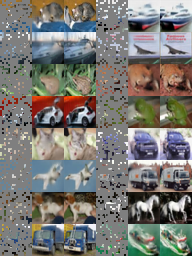

## 基于CIFAR10 MAE的实现

由于可用资源有限，我们仅在 cifar10 上测试模型。我们主要想重现这样的结果：**使用 MAE 预训练 ViT 可以比直接使用标签进行监督学习训练获得更好的结果**。这应该是**自我监督学习比监督学习更有效的数据**的证据。

我们主要遵循论文中的实现细节。但是，由于 Cifar10 和 ImageNet 的区别，我们做了一些修改：

- 我们使用 vit-tiny 而不是 vit-base。
- 由于 Cifar10 只有 50k 训练数据，我们将 pretraining epoch 从 400 增加到 2000，将 warmup epoch 从 40 增加到 200。我们注意到，在 2000 epoch 之后损失仍在减少。
- 我们将训练分类器的批量大小从 1024 减少到 512 以减轻过度拟合。

### Install

`pip install -r requirements.txt`

### Run

首先进行预训练

```python
# pretrained with mae
python mae_pretrain.py
```

训练未用MAE的分类器，也就是从头开始训练分类器

```
# train classifier from scratch
python train_classifier.py
```

利用训练好的MAE的encoder作为输入，构建的分类模型作为分类器

```python
# train classifier from pretrained model
python train_classifier.py --pretrained_model_path vit-t-mae.pth --output_model_path vit-t-classifier-from_pretrained.pth
```

集成了tensorboerd

```
tensorboard --logdir logs
```

可以查看结果

### Result

|Model|Validation Acc|
|-----|--------------|
|ViT-T w/o pretrain|74.13|
|ViT-T w/  pretrain|**89.77**|

可视化CIFAR10前16张的图片，也可以在TensorBoard中查看


