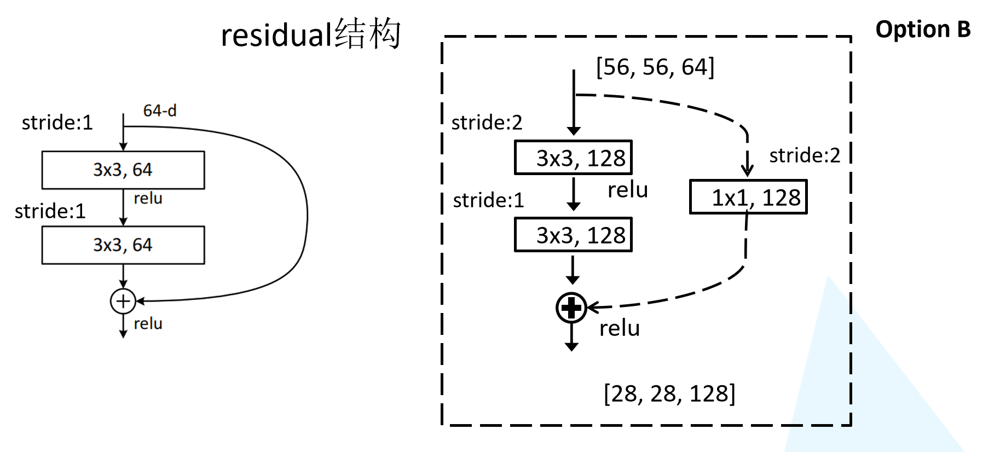
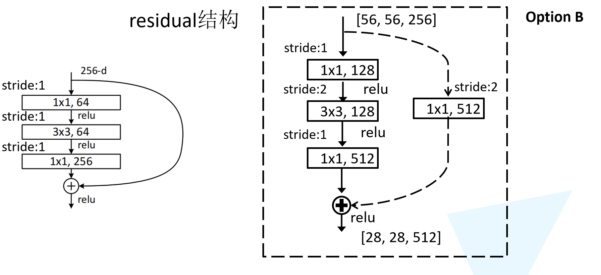

# Pytorch CIFAR10图像分类 ResNet篇

[toc]

这里贴一下汇总篇：[汇总篇](https://blog.csdn.net/weixin_45508265/article/details/119285255)

## 4.定义网络（ResNet）

当大家还在惊叹 GoogLeNet 的 inception 结构的时候，微软亚洲研究院的研究员已经在设计更深但结构更加简单的网络 ResNet，并且凭借这个网络斩获当年ImageNet竞赛中分类任务第一名，目标检测第一名。获得COCO数据集中目标检测第一名，图像分割第一名。# 4.定义网络（ResNet）

如果想详细了解并查看论文，可以看我的另一篇博客[【论文泛读】 ResNet：深度残差网络](https://blog.csdn.net/weixin_45508265/article/details/119069665)

下图是ResNet18层模型的结构简图


还有ResNet-34模型


在ResNet网络中有如下几个亮点：

（1）提出residual结构（残差结构），并搭建超深的网络结构(突破1000层)

（2）使用Batch Normalization加速训练(丢弃dropout)

在ResNet网络提出之前，传统的卷积神经网络都是通过将一系列卷积层与下采样层进行堆叠得到的。但是当堆叠到一定网络深度时，就会出现两个问题。

（1）梯度消失或梯度爆炸。 

（2）退化问题(degradation problem)。


### 残差结构

在ResNet论文中说通过数据的预处理以及在网络中使用BN（Batch Normalization）层能够解决梯度消失或者梯度爆炸问题，residual结构（残差结构）来减轻退化问题。此时拟合目标就变为F(x)，F(x)就是残差


这里有一个点是很重要的，对于我们的第二个layer，它是没有relu激活函数的，他需要与x相加最后再进行激活函数relu


### ResNet18/34 的Residual结构

我们先对ResNet18/34的残差结构进行一个分析。如下图所示，该残差结构的主分支是由两层3x3的卷积层组成，而残差结构右侧的连接线是shortcut分支也称捷径分支（注意为了让主分支上的输出矩阵能够与我们捷径分支上的输出矩阵进行相加，**必须保证这两个输出特征矩阵有相同的shape**）。我们会发现有一些虚线结构，论文中表述为用1x1的卷积进行降维，下图给出了详细的残差结构。



### ResNet50/101/152的Bottleneck结构

接着我们再来分析下针对ResNet50/101/152的残差结构，如下图所示。在该残差结构当中，主分支使用了三个卷积层，第一个是1x1的卷积层用来压缩channel维度，第二个是3x3的卷积层，第三个是1x1的卷积层用来还原channel维度（注意主分支上第一层卷积层和第二次卷积层所使用的卷积核个数是相同的，第三次是第一层的4倍），这种又叫做bottleneck模型


### ResNet网络结构配置

这是在ImageNet数据集中更深的残差网络的模型，这里面给出了残差结构给出了主分支上卷积核的大小与卷积核个数，表中的xN表示将该残差结构重复N次。


对于我们ResNet18/34/50/101/152，表中conv3_x, conv4_x, conv5_x所对应的一系列残差结构的第一层残差结构都是虚线残差结构。因为这一系列残差结构的第一层都有调整输入特征矩阵shape的使命（将特征矩阵的高和宽缩减为原来的一半，将深度channel调整成下一层残差结构所需要的channel）

- ResNet-50：我们用3层瓶颈块替换34层网络中的每一个2层块，得到了一个50层ResNe。我们使用1x1卷积核来增加维度。该模型有**38亿FLOP**。
- ResNet-101/152：我们通过使用更多的3层瓶颈块来构建101层和152层ResNets。值得注意的是，尽管深度显著增加，但152层ResNet（**113亿FLOP**）仍然比VGG-16/19网络（**153/196亿FLOP**）具有更低的复杂度。


首先我们还是得判断是否可以利用GPU，因为GPU的速度可能会比我们用CPU的速度快20-50倍左右，特别是对卷积神经网络来说，更是提升特别明显。

```python
device = 'cuda' if torch.cuda.is_available() else 'cpu'
```


### BasicBlock

对于浅层网络，如ResNet-18/34等，用基本的Block


```python
class BasicBlock(nn.Module):
    """
    对于浅层网络，如ResNet-18/34等，用基本的Block
    基础模块没有压缩,所以expansion=1
    """
    expansion = 1
    def __init__(self, in_channels, out_channels, stride=1):
        super(BasicBlock,self).__init__()
        self.features = nn.Sequential(
            nn.Conv2d(in_channels, out_channels, kernel_size=3, stride=stride, padding=1, bias=False),
            nn.BatchNorm2d(out_channels),
            nn.ReLU(True),
            nn.Conv2d(out_channels,out_channels, kernel_size=3, stride=1, padding=1, bias=False),
            nn.BatchNorm2d(out_channels)
        )
        # 如果输入输出维度不等，则使用1x1卷积层来改变维度
        self.shortcut = nn.Sequential()
        if stride != 1 or in_channels != self.expansion * out_channels:
            self.shortcut = nn.Sequential(
                nn.Conv2d(in_channels, self.expansion * out_channels, kernel_size=1, stride=stride, bias=False),
                nn.BatchNorm2d(self.expansion * out_channels),
            )
    def forward(self, x):
        out = self.features(x)
#         print(out.shape)
        out += self.shortcut(x)
        out = torch.relu(out)
        return out
```

```python
# 测试
basic_block = BasicBlock(64, 128)
print(basic_block)
x = torch.randn(2, 64, 32, 32)
y = basic_block(x)
print(y.shape)
```

> ```python
> BasicBlock(
>   (features): Sequential(
>     (0): Conv2d(64, 128, kernel_size=(3, 3), stride=(1, 1), padding=(1, 1), bias=False)
>     (1): BatchNorm2d(128, eps=1e-05, momentum=0.1, affine=True, track_running_stats=True)
>     (2): ReLU(inplace=True)
>     (3): Conv2d(128, 128, kernel_size=(3, 3), stride=(1, 1), padding=(1, 1), bias=False)
>     (4): BatchNorm2d(128, eps=1e-05, momentum=0.1, affine=True, track_running_stats=True)
>   )
>   (shortcut): Sequential(
>     (0): Conv2d(64, 128, kernel_size=(1, 1), stride=(1, 1), bias=False)
>     (1): BatchNorm2d(128, eps=1e-05, momentum=0.1, affine=True, track_running_stats=True)
>   )
> )
> torch.Size([2, 128, 32, 32])
> ```

### Bottleneck Block

对于深层网络，我们使用BottleNeck，论文中提出其拥有近似的计算复杂度，但能节省很多资源


```python
class Bottleneck(nn.Module):
    """
    对于深层网络，我们使用BottleNeck，论文中提出其拥有近似的计算复杂度，但能节省很多资源
    zip_channels: 压缩后的维数，最后输出的维数是 expansion * zip_channels
    针对ResNet50/101/152的网络结构,主要是因为第三层是第二层的4倍的关系所以expansion=4
    """
    expansion = 4
    
    def __init__(self, in_channels, zip_channels, stride=1):
        super(Bottleneck, self).__init__()
        out_channels = self.expansion * zip_channels
        self.features = nn.Sequential(
            nn.Conv2d(in_channels, zip_channels, kernel_size=1, bias=False),
            nn.BatchNorm2d(zip_channels),
            nn.ReLU(inplace=True),
            nn.Conv2d(zip_channels, zip_channels, kernel_size=3, stride=stride, padding=1, bias=False),
            nn.BatchNorm2d(zip_channels),
            nn.ReLU(inplace=True),
            nn.Conv2d(zip_channels, out_channels, kernel_size=1, bias=False),
            nn.BatchNorm2d(out_channels)
        )
        self.shortcut = nn.Sequential()
        if stride != 1 or in_channels != out_channels:
            self.shortcut = nn.Sequential(
                nn.Conv2d(in_channels, out_channels, kernel_size=1, stride=stride, bias=False),
                nn.BatchNorm2d(out_channels)
            )
            
    def forward(self, x):
        out = self.features(x)
#         print(out.shape)
        out += self.shortcut(x)
        out = torch.relu(out)
        return out
```

```python
# 测试
bottleneck = Bottleneck(256, 128)
print(bottleneck)
x = torch.randn(2, 256, 32, 32)
y = bottleneck(x)
print(y.shape)
```

> ```python
> Bottleneck(
>   (features): Sequential(
>     (0): Conv2d(256, 128, kernel_size=(1, 1), stride=(1, 1), bias=False)
>     (1): BatchNorm2d(128, eps=1e-05, momentum=0.1, affine=True, track_running_stats=True)
>     (2): ReLU(inplace=True)
>     (3): Conv2d(128, 128, kernel_size=(3, 3), stride=(1, 1), padding=(1, 1), bias=False)
>     (4): BatchNorm2d(128, eps=1e-05, momentum=0.1, affine=True, track_running_stats=True)
>     (5): ReLU(inplace=True)
>     (6): Conv2d(128, 512, kernel_size=(1, 1), stride=(1, 1), bias=False)
>     (7): BatchNorm2d(512, eps=1e-05, momentum=0.1, affine=True, track_running_stats=True)
>   )
>   (shortcut): Sequential(
>     (0): Conv2d(256, 512, kernel_size=(1, 1), stride=(1, 1), bias=False)
>     (1): BatchNorm2d(512, eps=1e-05, momentum=0.1, affine=True, track_running_stats=True)
>   )
> )
> torch.Size([2, 512, 32, 32])
> ```

### ResNet

不同的ResNet架构都是统一的一层特征提取、四层残差，不同点在于每层残差的深度。

```python
class ResNet(nn.Module):
    """
    不同的ResNet架构都是统一的一层特征提取、四层残差，不同点在于每层残差的深度。
    对于cifar10，feature map size的变化如下：
    (32, 32, 3) -> [Conv2d] -> (32, 32, 64) -> [Res1] -> (32, 32, 64) -> [Res2] 
 -> (16, 16, 128) -> [Res3] -> (8, 8, 256) ->[Res4] -> (4, 4, 512) -> [AvgPool] 
 -> (1, 1, 512) -> [Reshape] -> (512) -> [Linear] -> (10)
    """
    def __init__(self, block, num_blocks, num_classes=10, verbose = False):
        super(ResNet, self).__init__()
        self.verbose = verbose
        self.in_channels = 64
        self.features = nn.Sequential(
            nn.Conv2d(3, 64, kernel_size=3, stride=1, padding=1, bias=False),
            nn.BatchNorm2d(64),
            nn.ReLU(inplace=True)
        )
        #使用_make_layer函数生成上表对应的conv2_x, conv3_x, conv4_x, conv5_x的结构
        self.layer1 = self._make_layer(block, 64, num_blocks[0], stride=1)
        self.layer2 = self._make_layer(block, 128, num_blocks[1], stride=2)
        self.layer3 = self._make_layer(block, 256, num_blocks[2], stride=2)
        self.layer4 = self._make_layer(block, 512, num_blocks[3], stride=2)
        # cifar10经过上述结构后，到这里的feature map size是 4 x 4 x 512 x expansion
        # 所以这里用了 4 x 4 的平均池化
        self.avg_pool = nn.AvgPool2d(kernel_size=4)
        self.classifer = nn.Linear(512 * block.expansion, num_classes)
        
    def _make_layer(self, block, out_channels, num_blocks, stride):
        # 第一个block要进行降采样
        strides = [stride] + [1] * (num_blocks - 1)
        layers = []
        for stride in strides:
            layers.append(block(self.in_channels, out_channels, stride))
            # 如果是Bottleneck Block的话需要对每层输入的维度进行压缩，压缩后再增加维数
            # 所以每层的输入维数也要跟着变
            self.in_channels = out_channels * block.expansion
        return nn.Sequential(*layers)
    
    def forward(self, x):
        out = self.features(x)
        if self.verbose:
            print('block 1 output: {}'.format(out.shape))
        out = self.layer1(out)        
        if self.verbose:
            print('block 2 output: {}'.format(out.shape))
        out = self.layer2(out)
        if self.verbose:
            print('block 3 output: {}'.format(out.shape))
        out = self.layer3(out)
        if self.verbose:
            print('block 4 output: {}'.format(out.shape))
        out = self.layer4(out)
        if self.verbose:
            print('block 5 output: {}'.format(out.shape))
        out = self.avg_pool(out)
        out = out.view(out.size(0), -1)
        out = self.classifer(out)
        return out
```

```python
def ResNet18(verbose=False):
    return ResNet(BasicBlock, [2,2,2,2],verbose=verbose)

def ResNet34(verbose=False):
    return ResNet(BasicBlock, [3,4,6,3],verbose=verbose)

def ResNet50(verbose=False):
    return ResNet(Bottleneck, [3,4,6,3],verbose=verbose)

def ResNet101(verbose=False):
    return ResNet(Bottleneck, [3,4,23,3],verbose=verbose)

def ResNet152(verbose=False):
    return ResNet(Bottleneck, [3,8,36,3],verbose=verbose)

net = ResNet18(True).to(device)
```

```python
summary(net,(3,32,32))
```

> ```python
> block 1 output: torch.Size([2, 64, 32, 32])
> block 2 output: torch.Size([2, 64, 32, 32])
> block 3 output: torch.Size([2, 128, 16, 16])
> block 4 output: torch.Size([2, 256, 8, 8])
> block 5 output: torch.Size([2, 512, 4, 4])
> ----------------------------------------------------------------
>         Layer (type)               Output Shape         Param #
> ================================================================
>             Conv2d-1           [-1, 64, 32, 32]           1,728
>        BatchNorm2d-2           [-1, 64, 32, 32]             128
>               ReLU-3           [-1, 64, 32, 32]               0
>             Conv2d-4           [-1, 64, 32, 32]          36,864
>        BatchNorm2d-5           [-1, 64, 32, 32]             128
>               ReLU-6           [-1, 64, 32, 32]               0
>             Conv2d-7           [-1, 64, 32, 32]          36,864
>        BatchNorm2d-8           [-1, 64, 32, 32]             128
>         BasicBlock-9           [-1, 64, 32, 32]               0
>            Conv2d-10           [-1, 64, 32, 32]          36,864
>       BatchNorm2d-11           [-1, 64, 32, 32]             128
>              ReLU-12           [-1, 64, 32, 32]               0
>            Conv2d-13           [-1, 64, 32, 32]          36,864
>       BatchNorm2d-14           [-1, 64, 32, 32]             128
>        BasicBlock-15           [-1, 64, 32, 32]               0
>            Conv2d-16          [-1, 128, 16, 16]          73,728
>       BatchNorm2d-17          [-1, 128, 16, 16]             256
>              ReLU-18          [-1, 128, 16, 16]               0
>            Conv2d-19          [-1, 128, 16, 16]         147,456
>       BatchNorm2d-20          [-1, 128, 16, 16]             256
>            Conv2d-21          [-1, 128, 16, 16]           8,192
>       BatchNorm2d-22          [-1, 128, 16, 16]             256
>        BasicBlock-23          [-1, 128, 16, 16]               0
>            Conv2d-24          [-1, 128, 16, 16]         147,456
>       BatchNorm2d-25          [-1, 128, 16, 16]             256
>              ReLU-26          [-1, 128, 16, 16]               0
>            Conv2d-27          [-1, 128, 16, 16]         147,456
>       BatchNorm2d-28          [-1, 128, 16, 16]             256
>        BasicBlock-29          [-1, 128, 16, 16]               0
>            Conv2d-30            [-1, 256, 8, 8]         294,912
>       BatchNorm2d-31            [-1, 256, 8, 8]             512
>              ReLU-32            [-1, 256, 8, 8]               0
>            Conv2d-33            [-1, 256, 8, 8]         589,824
>       BatchNorm2d-34            [-1, 256, 8, 8]             512
>            Conv2d-35            [-1, 256, 8, 8]          32,768
>       BatchNorm2d-36            [-1, 256, 8, 8]             512
>        BasicBlock-37            [-1, 256, 8, 8]               0
>            Conv2d-38            [-1, 256, 8, 8]         589,824
>       BatchNorm2d-39            [-1, 256, 8, 8]             512
>              ReLU-40            [-1, 256, 8, 8]               0
>            Conv2d-41            [-1, 256, 8, 8]         589,824
>       BatchNorm2d-42            [-1, 256, 8, 8]             512
>        BasicBlock-43            [-1, 256, 8, 8]               0
>            Conv2d-44            [-1, 512, 4, 4]       1,179,648
>       BatchNorm2d-45            [-1, 512, 4, 4]           1,024
>              ReLU-46            [-1, 512, 4, 4]               0
>            Conv2d-47            [-1, 512, 4, 4]       2,359,296
>       BatchNorm2d-48            [-1, 512, 4, 4]           1,024
>            Conv2d-49            [-1, 512, 4, 4]         131,072
>       BatchNorm2d-50            [-1, 512, 4, 4]           1,024
>        BasicBlock-51            [-1, 512, 4, 4]               0
>            Conv2d-52            [-1, 512, 4, 4]       2,359,296
>       BatchNorm2d-53            [-1, 512, 4, 4]           1,024
>              ReLU-54            [-1, 512, 4, 4]               0
>            Conv2d-55            [-1, 512, 4, 4]       2,359,296
>       BatchNorm2d-56            [-1, 512, 4, 4]           1,024
>        BasicBlock-57            [-1, 512, 4, 4]               0
>         AvgPool2d-58            [-1, 512, 1, 1]               0
>            Linear-59                   [-1, 10]           5,130
> ================================================================
> Total params: 11,173,962
> Trainable params: 11,173,962
> Non-trainable params: 0
> ----------------------------------------------------------------
> Input size (MB): 0.01
> Forward/backward pass size (MB): 13.63
> Params size (MB): 42.63
> Estimated Total Size (MB): 56.27
> ----------------------------------------------------------------
> ```


首先从我们summary可以看到，我们定义的模型的参数大概是11 millions，我们输入的是（batch，3，32，32）的张量，并且这里也能看到每一层后我们的图像输出大小的变化，最后输出10个参数，再通过softmax函数就可以得到我们每个类别的概率了。

我们也可以打印出我们的模型观察一下

```python
print(net)
```

> ```python
> ResNet(
> (features): Sequential(
>  (0): Conv2d(3, 64, kernel_size=(3, 3), stride=(1, 1), padding=(1, 1), bias=False)
>  (1): BatchNorm2d(64, eps=1e-05, momentum=0.1, affine=True, track_running_stats=True)
>  (2): ReLU(inplace=True)
> )
> (layer1): Sequential(
>  (0): BasicBlock(
>    (features): Sequential(
>      (0): Conv2d(64, 64, kernel_size=(3, 3), stride=(1, 1), padding=(1, 1), bias=False)
>      (1): BatchNorm2d(64, eps=1e-05, momentum=0.1, affine=True, track_running_stats=True)
>      (2): ReLU(inplace=True)
>      (3): Conv2d(64, 64, kernel_size=(3, 3), stride=(1, 1), padding=(1, 1), bias=False)
>      (4): BatchNorm2d(64, eps=1e-05, momentum=0.1, affine=True, track_running_stats=True)
>    )
>    (shortcut): Sequential()
>  )
>  (1): BasicBlock(
>    (features): Sequential(
>      (0): Conv2d(64, 64, kernel_size=(3, 3), stride=(1, 1), padding=(1, 1), bias=False)
>      (1): BatchNorm2d(64, eps=1e-05, momentum=0.1, affine=True, track_running_stats=True)
>      (2): ReLU(inplace=True)
>      (3): Conv2d(64, 64, kernel_size=(3, 3), stride=(1, 1), padding=(1, 1), bias=False)
>      (4): BatchNorm2d(64, eps=1e-05, momentum=0.1, affine=True, track_running_stats=True)
>    )
>    (shortcut): Sequential()
>  )
> )
> (layer2): Sequential(
>  (0): BasicBlock(
>    (features): Sequential(
>      (0): Conv2d(64, 128, kernel_size=(3, 3), stride=(2, 2), padding=(1, 1), bias=False)
>      (1): BatchNorm2d(128, eps=1e-05, momentum=0.1, affine=True, track_running_stats=True)
>      (2): ReLU(inplace=True)
>      (3): Conv2d(128, 128, kernel_size=(3, 3), stride=(1, 1), padding=(1, 1), bias=False)
>      (4): BatchNorm2d(128, eps=1e-05, momentum=0.1, affine=True, track_running_stats=True)
>    )
>    (shortcut): Sequential(
>      (0): Conv2d(64, 128, kernel_size=(1, 1), stride=(2, 2), bias=False)
>      (1): BatchNorm2d(128, eps=1e-05, momentum=0.1, affine=True, track_running_stats=True)
>    )
>  )
>  (1): BasicBlock(
>    (features): Sequential(
>      (0): Conv2d(128, 128, kernel_size=(3, 3), stride=(1, 1), padding=(1, 1), bias=False)
>      (1): BatchNorm2d(128, eps=1e-05, momentum=0.1, affine=True, track_running_stats=True)
>      (2): ReLU(inplace=True)
>      (3): Conv2d(128, 128, kernel_size=(3, 3), stride=(1, 1), padding=(1, 1), bias=False)
>      (4): BatchNorm2d(128, eps=1e-05, momentum=0.1, affine=True, track_running_stats=True)
>    )
>    (shortcut): Sequential()
>  )
> )
> (layer3): Sequential(
>  (0): BasicBlock(
>    (features): Sequential(
>      (0): Conv2d(128, 256, kernel_size=(3, 3), stride=(2, 2), padding=(1, 1), bias=False)
>      (1): BatchNorm2d(256, eps=1e-05, momentum=0.1, affine=True, track_running_stats=True)
>      (2): ReLU(inplace=True)
>      (3): Conv2d(256, 256, kernel_size=(3, 3), stride=(1, 1), padding=(1, 1), bias=False)
>      (4): BatchNorm2d(256, eps=1e-05, momentum=0.1, affine=True, track_running_stats=True)
>    )
>    (shortcut): Sequential(
>      (0): Conv2d(128, 256, kernel_size=(1, 1), stride=(2, 2), bias=False)
>      (1): BatchNorm2d(256, eps=1e-05, momentum=0.1, affine=True, track_running_stats=True)
>    )
>  )
>  (1): BasicBlock(
>    (features): Sequential(
>      (0): Conv2d(256, 256, kernel_size=(3, 3), stride=(1, 1), padding=(1, 1), bias=False)
>      (1): BatchNorm2d(256, eps=1e-05, momentum=0.1, affine=True, track_running_stats=True)
>      (2): ReLU(inplace=True)
>      (3): Conv2d(256, 256, kernel_size=(3, 3), stride=(1, 1), padding=(1, 1), bias=False)
>      (4): BatchNorm2d(256, eps=1e-05, momentum=0.1, affine=True, track_running_stats=True)
>    )
>    (shortcut): Sequential()
>  )
> )
> (layer4): Sequential(
>  (0): BasicBlock(
>    (features): Sequential(
>      (0): Conv2d(256, 512, kernel_size=(3, 3), stride=(2, 2), padding=(1, 1), bias=False)
>      (1): BatchNorm2d(512, eps=1e-05, momentum=0.1, affine=True, track_running_stats=True)
>      (2): ReLU(inplace=True)
>      (3): Conv2d(512, 512, kernel_size=(3, 3), stride=(1, 1), padding=(1, 1), bias=False)
>      (4): BatchNorm2d(512, eps=1e-05, momentum=0.1, affine=True, track_running_stats=True)
>    )
>    (shortcut): Sequential(
>      (0): Conv2d(256, 512, kernel_size=(1, 1), stride=(2, 2), bias=False)
>      (1): BatchNorm2d(512, eps=1e-05, momentum=0.1, affine=True, track_running_stats=True)
>    )
>  )
>  (1): BasicBlock(
>    (features): Sequential(
>      (0): Conv2d(512, 512, kernel_size=(3, 3), stride=(1, 1), padding=(1, 1), bias=False)
>      (1): BatchNorm2d(512, eps=1e-05, momentum=0.1, affine=True, track_running_stats=True)
>      (2): ReLU(inplace=True)
>      (3): Conv2d(512, 512, kernel_size=(3, 3), stride=(1, 1), padding=(1, 1), bias=False)
>      (4): BatchNorm2d(512, eps=1e-05, momentum=0.1, affine=True, track_running_stats=True)
>    )
>    (shortcut): Sequential()
>  )
> )
> (avg_pool): AvgPool2d(kernel_size=4, stride=4, padding=0)
> (classifer): Linear(in_features=512, out_features=10, bias=True)
> )
> ```

我们也可以测试一下输出

```python
# 测试
x = torch.randn(2, 3, 32, 32).to(device)
y = net(x)
print(y.shape)
```

```python
block 1 output: torch.Size([2, 64, 32, 32])
block 2 output: torch.Size([2, 64, 32, 32])
block 3 output: torch.Size([2, 128, 16, 16])
block 4 output: torch.Size([2, 256, 8, 8])
block 5 output: torch.Size([2, 512, 4, 4])
torch.Size([2, 10])
```

如果你的电脑有多个GPU，这段代码可以利用GPU进行并行计算，加快运算速度

```python
net = ResNet34().to(device)
if device == 'cuda':
    net = nn.DataParallel(net)
    # 当计算图不会改变的时候（每次输入形状相同，模型不改变）的情况下可以提高性能，反之则降低性能
    torch.backends.cudnn.benchmark = True
```


## 5. 定义损失函数和优化器

pytorch将深度学习中常用的优化方法全部封装在torch.optim之中，所有的优化方法都是继承基类optim.Optimizier
损失函数是封装在神经网络工具箱nn中的,包含很多损失函数

这里我使用的是SGD + momentum算法，并且我们损失函数定义为交叉熵函数，除此之外学习策略定义为动态更新学习率，如果5次迭代后，训练的损失并没有下降，那么我们便会更改学习率，会变为原来的0.5倍，最小降低到0.00001

如果想更加了解优化器和学习率策略的话，可以参考以下资料

- [Pytorch Note15 优化算法1 梯度下降（Gradient descent varients）](https://blog.csdn.net/weixin_45508265/article/details/117859824)
- [Pytorch Note16 优化算法2 动量法(Momentum)](https://blog.csdn.net/weixin_45508265/article/details/117874046)
- [Pytorch Note34 学习率衰减](https://blog.csdn.net/weixin_45508265/article/details/119089705)

这里决定迭代20次

```python
import torch.optim as optimoptimizer = optim.SGD(net.parameters(), lr=1e-1, momentum=0.9, weight_decay=5e-4)criterion = nn.CrossEntropyLoss()scheduler = optim.lr_scheduler.ReduceLROnPlateau(optimizer, 'min', factor=0.5 ,patience = 5,min_lr = 0.000001) # 动态更新学习率# scheduler = optim.lr_scheduler.MultiStepLR(optimizer, milestones=[75, 150], gamma=0.5)import timeepoch = 20
```

## 6. 训练

首先定义模型保存的位置

```python
import os
if not os.path.exists('./model'):
    os.makedirs('./model')
else:
    print('文件已存在')
save_path = './model/ResNet34.pth'
```

我定义了一个train函数，在train函数中进行一个训练，并保存我们训练后的模型

```python
from utils import train
from utils import plot_history
Acc, Loss, Lr = train(net, trainloader, testloader, epoch, optimizer, criterion, scheduler, save_path, verbose = True)
```

> ```python
> Epoch [  1/ 20]  Train Loss:2.159606  Train Acc:23.53% Test Loss:1.755478  Test Acc:33.49%  Learning Rate:0.100000	Time 03:02
> Epoch [  2/ 20]  Train Loss:1.638957  Train Acc:38.55% Test Loss:1.501977  Test Acc:45.09%  Learning Rate:0.100000	Time 02:57
> Epoch [  3/ 20]  Train Loss:1.406517  Train Acc:48.46% Test Loss:1.428001  Test Acc:48.31%  Learning Rate:0.100000	Time 02:56
> Epoch [  4/ 20]  Train Loss:1.206273  Train Acc:56.53% Test Loss:1.172715  Test Acc:58.97%  Learning Rate:0.100000	Time 02:56
> Epoch [  5/ 20]  Train Loss:1.038469  Train Acc:62.78% Test Loss:1.046036  Test Acc:63.54%  Learning Rate:0.100000	Time 03:10
> Epoch [  6/ 20]  Train Loss:0.910261  Train Acc:67.88% Test Loss:0.980679  Test Acc:65.65%  Learning Rate:0.100000	Time 03:30
> Epoch [  7/ 20]  Train Loss:0.806868  Train Acc:71.54% Test Loss:0.863342  Test Acc:69.91%  Learning Rate:0.100000	Time 03:27
> Epoch [  8/ 20]  Train Loss:0.718442  Train Acc:74.87% Test Loss:0.922080  Test Acc:68.44%  Learning Rate:0.100000	Time 03:11
> Epoch [  9/ 20]  Train Loss:0.639691  Train Acc:77.75% Test Loss:0.760849  Test Acc:73.81%  Learning Rate:0.100000	Time 02:57
> Epoch [ 10/ 20]  Train Loss:0.588514  Train Acc:79.64% Test Loss:0.627114  Test Acc:78.40%  Learning Rate:0.100000	Time 02:58
> Epoch [ 11/ 20]  Train Loss:0.531749  Train Acc:81.48% Test Loss:0.810104  Test Acc:73.08%  Learning Rate:0.100000	Time 03:02
> Epoch [ 12/ 20]  Train Loss:0.493843  Train Acc:82.86% Test Loss:0.604436  Test Acc:79.85%  Learning Rate:0.100000	Time 03:03
> Epoch [ 13/ 20]  Train Loss:0.464070  Train Acc:84.13% Test Loss:0.703119  Test Acc:76.75%  Learning Rate:0.100000	Time 03:08
> Epoch [ 14/ 20]  Train Loss:0.435086  Train Acc:85.07% Test Loss:0.573155  Test Acc:81.00%  Learning Rate:0.100000	Time 03:05
> Epoch [ 15/ 20]  Train Loss:0.408148  Train Acc:86.04% Test Loss:0.762852  Test Acc:76.57%  Learning Rate:0.100000	Time 03:06
> Epoch [ 16/ 20]  Train Loss:0.385001  Train Acc:86.77% Test Loss:0.602157  Test Acc:78.96%  Learning Rate:0.100000	Time 03:05
> Epoch [ 17/ 20]  Train Loss:0.381946  Train Acc:86.90% Test Loss:0.476164  Test Acc:83.56%  Learning Rate:0.100000	Time 02:57
> Epoch [ 18/ 20]  Train Loss:0.364283  Train Acc:87.46% Test Loss:0.442250  Test Acc:85.27%  Learning Rate:0.100000	Time 03:03
> Epoch [ 19/ 20]  Train Loss:0.353942  Train Acc:87.81% Test Loss:0.487022  Test Acc:83.77%  Learning Rate:0.100000	Time 02:56
> Epoch [ 20/ 20]  Train Loss:0.342116  Train Acc:88.22% Test Loss:0.554701  Test Acc:81.68%  Learning Rate:0.100000	Time 03:00
> ```


接着可以分别打印，损失函数曲线，准确率曲线和学习率曲线

```python
plot_history(epoch ,Acc, Loss, Lr)
```

### 损失函数曲线


### 准确率曲线


### 学习率曲线


## 7.测试

### 查看准确率

```python
correct = 0   # 定义预测正确的图片数，初始化为0
total = 0     # 总共参与测试的图片数，也初始化为0
# testloader = torch.utils.data.DataLoader(testset, batch_size=32,shuffle=True, num_workers=2)
for data in testloader:  # 循环每一个batch
    images, labels = data
    images = images.to(device)
    labels = labels.to(device)
    net.eval()  # 把模型转为test模式
    if hasattr(torch.cuda, 'empty_cache'):
        torch.cuda.empty_cache()
    outputs = net(images)  # 输入网络进行测试
    
    # outputs.data是一个4x10张量，将每一行的最大的那一列的值和序号各自组成一个一维张量返回，第一个是值的张量，第二个是序号的张量。
    _, predicted = torch.max(outputs.data, 1)
    total += labels.size(0)          # 更新测试图片的数量
    correct += (predicted == labels).sum() # 更新正确分类的图片的数量

print('Accuracy of the network on the 10000 test images: %.2f %%' % (100 * correct / total))
 
```

> ```python
> Accuracy of the network on the 10000 test images: 82.01 %
> ```

可以看到自定义网络的模型在测试集中准确率达到82.01%


程序中的 `torch.max(outputs.data, 1)` ，返回一个tuple (元组)

而这里很明显，这个返回的元组的第一个元素是image data，即是最大的 值，第二个元素是label， 即是最大的值 的 索引！我们只需要label（最大值的索引），所以就会有` _ `,predicted这样的赋值语句，表示忽略第一个返回值，把它赋值给` _`， 就是舍弃它的意思；

### 查看每一类的准确率

```python
 # 定义2个存储每类中测试正确的个数的 列表，初始化为0
class_correct = list(0. for i in range(10))
class_total = list(0. for i in range(10))
# testloader = torch.utils.data.DataLoader(testset, batch_size=64,shuffle=True, num_workers=2)
net.eval()
with torch.no_grad():
    for data in testloader:
        images, labels = data
        images = images.to(device)
        labels = labels.to(device)
        if hasattr(torch.cuda, 'empty_cache'):
            torch.cuda.empty_cache()
        outputs = net(images)

        _, predicted = torch.max(outputs.data, 1)
    #4组(batch_size)数据中，输出于label相同的，标记为1，否则为0
        c = (predicted == labels).squeeze()
        for i in range(len(images)):      # 因为每个batch都有4张图片，所以还需要一个4的小循环
            label = labels[i]   # 对各个类的进行各自累加
            class_correct[label] += c[i]
            class_total[label] += 1
 
 
for i in range(10):
    print('Accuracy of %5s : %.2f %%' % (classes[i], 100 * class_correct[i] / class_total[i]))
```

> ```python
> Accuracy of airplane : 62.40 %
> Accuracy of automobile : 91.80 %
> Accuracy of  bird : 86.10 %
> Accuracy of   cat : 58.70 %
> Accuracy of  deer : 87.30 %
> Accuracy of   dog : 82.50 %
> Accuracy of  frog : 93.90 %
> Accuracy of horse : 84.70 %
> Accuracy of  ship : 89.20 %
> Accuracy of truck : 83.20 %
> ```

### 抽样测试并可视化一部分结果

```python
dataiter = iter(testloader)
images, labels = dataiter.next()
images_ = images
#images_ = images_.view(images.shape[0], -1)
images_ = images_.to(device)
labels = labels.to(device)
val_output = net(images_)
_, val_preds = torch.max(val_output, 1)

fig = plt.figure(figsize=(25,4))

correct = torch.sum(val_preds == labels.data).item()

val_preds = val_preds.cpu()
labels = labels.cpu()

print("Accuracy Rate = {}%".format(correct/len(images) * 100))

fig = plt.figure(figsize=(25,25))
for idx in np.arange(64):    
    ax = fig.add_subplot(8, 8, idx+1, xticks=[], yticks=[])
    #fig.tight_layout()
#     plt.imshow(im_convert(images[idx]))
    imshow(images[idx])
    ax.set_title("{}, ({})".format(classes[val_preds[idx].item()], classes[labels[idx].item()]), 
                 color = ("green" if val_preds[idx].item()==labels[idx].item() else "red"))
```

> ```python
> Accuracy Rate = 81.25%
> <Figure size 1800x288 with 0 Axes>
> ```


## 8. 保存模型

```python
torch.save(net,save_path[:-4]+'_'+str(epoch)+'.pth')
# torch.save(net, './model/ResNet34.pth')
```

## 9. 预测

### 读取本地图片进行预测

```python
import torch
from PIL import Image
from torch.autograd import Variable
import torch.nn.functional as F
from torchvision import datasets, transforms
import numpy as np
 
classes = ('plane', 'car', 'bird', 'cat',
           'deer', 'dog', 'frog', 'horse', 'ship', 'truck')

device = torch.device('cuda' if torch.cuda.is_available() else 'cpu')

model = ResNet34()

model = torch.load(save_path)  # 加载模型
# model = model.to('cuda')
model.eval()  # 把模型转为test模式

# 读取要预测的图片
img = Image.open("./airplane.jpg").convert('RGB') # 读取图像
```

```
img
```


接着我们就进行预测图片，不过这里有一个点，我们需要对我们的图片也进行transforms，因为我们的训练的时候，对每个图像也是进行了transforms的，所以我们需要保持一致

```python
trans = transforms.Compose([transforms.Scale((32,32)),
                            transforms.ToTensor(),
                            transforms.Normalize(mean=(0.5, 0.5, 0.5), 
                                                 std=(0.5, 0.5, 0.5)),
                           ])
 
img = trans(img)
img = img.to(device)
# 图片扩展多一维,因为输入到保存的模型中是4维的[batch_size,通道,长，宽]，而普通图片只有三维，[通道,长，宽]
img = img.unsqueeze(0)  
    # 扩展后，为[1，3，32，32]
output = model(img)
prob = F.softmax(output,dim=1) #prob是10个分类的概率
print("概率",prob)
value, predicted = torch.max(output.data, 1)
print("类别",predicted.item())
print(value)
pred_class = classes[predicted.item()]
print("分类",pred_class)
```

> ```python
> 概率 tensor([[9.9965e-01, 3.6513e-06, 1.7105e-04, 5.1874e-06, 9.1150e-05, 2.3654e-07,
>          1.0426e-06, 3.9004e-07, 7.9401e-05, 2.4640e-06]], device='cuda:0',
>        grad_fn=<SoftmaxBackward>)
> 类别 0
> tensor([10.8828], device='cuda:0')
> 分类 plane
> ```

这里就可以看到，我们最后的结果，分类为plane，我们的置信率大概是99.96%，可以说是比较准确的了

### 读取图片地址进行预测

我们也可以通过读取图片的url地址进行预测，这里我找了多个不同的图片进行预测

```python
import requests
from PIL import Image
url = 'https://dss2.bdstatic.com/70cFvnSh_Q1YnxGkpoWK1HF6hhy/it/u=947072664,3925280208&fm=26&gp=0.jpg'
url = 'https://ss0.bdstatic.com/70cFuHSh_Q1YnxGkpoWK1HF6hhy/it/u=2952045457,215279295&fm=26&gp=0.jpg'
url = 'https://ss0.bdstatic.com/70cFvHSh_Q1YnxGkpoWK1HF6hhy/it/u=2838383012,1815030248&fm=26&gp=0.jpg'
url = 'https://gimg2.baidu.com/image_search/src=http%3A%2F%2Fwww.goupuzi.com%2Fnewatt%2FMon_1809%2F1_179223_7463b117c8a2c76.jpg&refer=http%3A%2F%2Fwww.goupuzi.com&app=2002&size=f9999,10000&q=a80&n=0&g=0n&fmt=jpeg?sec=1624346733&t=36ba18326a1e010737f530976201326d'
url = 'https://ss3.bdstatic.com/70cFv8Sh_Q1YnxGkpoWK1HF6hhy/it/u=2799543344,3604342295&fm=224&gp=0.jpg'
# url = 'https://ss1.bdstatic.com/70cFuXSh_Q1YnxGkpoWK1HF6hhy/it/u=2032505694,2851387785&fm=26&gp=0.jpg'
response = requests.get(url, stream=True)
print (response)
img = Image.open(response.raw)
img
```


这里和前面是一样的

```python
trans = transforms.Compose([transforms.Scale((32,32)),
                            transforms.ToTensor(),
                            transforms.Normalize(mean=(0.5, 0.5, 0.5), 
                                                 std=(0.5, 0.5, 0.5)),
                           ])
 
img = trans(img)
img = img.to(device)
# 图片扩展多一维,因为输入到保存的模型中是4维的[batch_size,通道,长，宽]，而普通图片只有三维，[通道,长，宽]
img = img.unsqueeze(0)  
    # 扩展后，为[1，3，32，32]
output = model(img)
prob = F.softmax(output,dim=1) #prob是10个分类的概率
print("概率",prob)
value, predicted = torch.max(output.data, 1)
print("类别",predicted.item())
print(value)
pred_class = classes[predicted.item()]
print("分类",pred_class)
```

> ```python
> 概率 tensor([[5.0480e-02, 3.3666e-04, 9.2583e-03, 7.4729e-01, 3.3520e-03, 1.6813e-01,
>          7.2700e-03, 3.9508e-03, 8.4040e-03, 1.5270e-03]], device='cuda:0',
>        grad_fn=<SoftmaxBackward>)
> 类别 3
> tensor([4.2263], device='cuda:0')
> 分类 cat
> ```

对于这个网络图片来说，我们分类的结果是cat，符合我们的判断，置信率达到了92.58%，可以看出来，我们的残差网络在图像识别中取得了不错的结果。


## 10.总结

残差网络的出现，可以说极大的提高了我们的准确率，简化比以前使用的网络更深的网络的训练。而且有更多的证据表明这些残差网络更容易优化，并且可以从显着增加的深度中获得准确性。并且利用残差网络结构，我们也可以堆叠我们网络的深度，这种堆叠不会出现退化问题，所以残差网络的出现体现了`very deep`的未来，对计算机视觉领域作出了很大的贡献


顺带提一句，我们的数据和代码都在我的汇总篇里有说明，如果需要，可以自取

这里再贴一下汇总篇：[汇总篇](https://blog.csdn.net/weixin_45508265/article/details/119285255)

