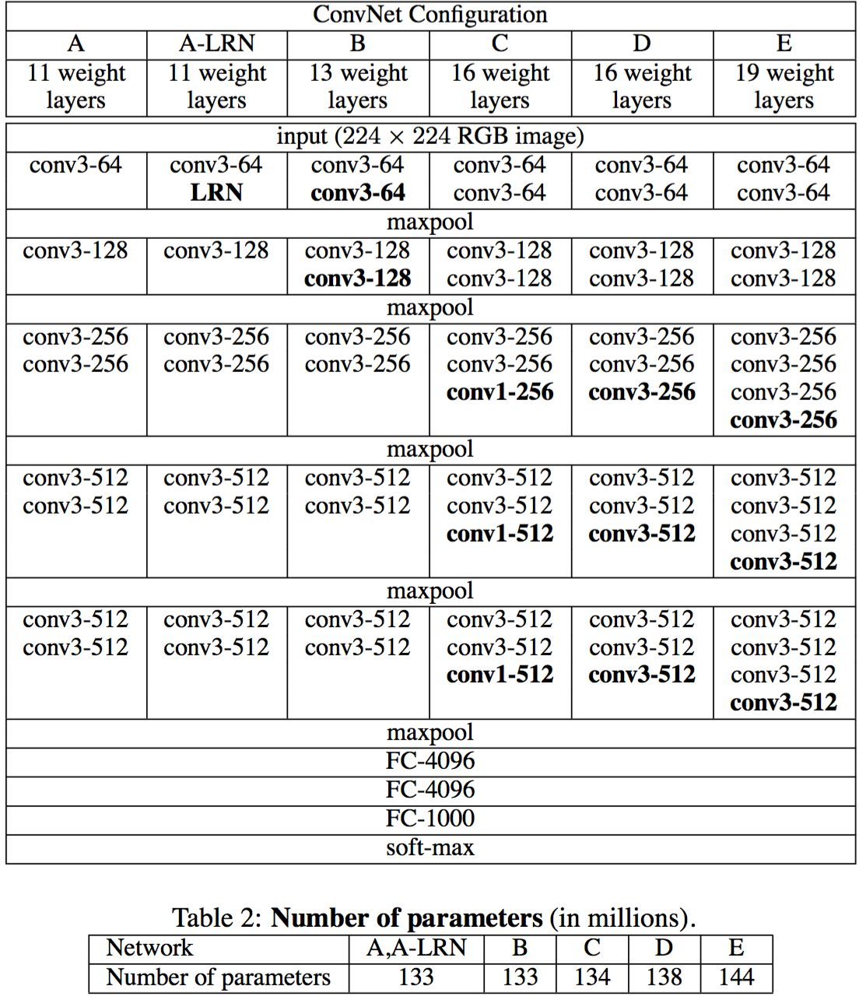

# Pytorch CIFAR10图像分类 VGG篇

[toc]

这里贴一下汇总篇：[汇总篇](https://blog.csdn.net/weixin_45508265/article/details/119285255)

## 4.定义网络（VGG）

VGG模型是Oxford的Visual Geometry Group的组提出的，这个网络是在ILSVRC 2014上进行相关的工作，在ILSVRC 2014中超过Alex Net网络，拿到了当时分类项目的top 2 和 定位项目的top 1，VGGNet的拓展性很强，迁移到其他图片数据上的泛化性非常好。从此VGG进入了我们的视野，主要证明了增加网络的深度能够在一定程度上影响了网络最终的性能。

VGG net可以说是从Alex-net发展而来的网络，VGGNet论文中全部使用了3x3的卷积核和2x2的池化核，通过不断加深网络结构来提升性能，现在主要的都是VGG16和VGG19，顾名思义，就是有16层和19层。
在论文[《Very Deep Convolutional Networks for Large-Scale Image Recognition》](https://arxiv.org/abs/1409.1556)详细的给出了VGG的详细介绍，D和E分别就是我们的VGG16和VGG19。先以VGG16为例子，VGG有16层，我把它分为六块.



**VGG-16 一些性质：**

VGG 是一个很经典的卷积神经网络结构，是由 AlexNet 改进的，相比于 AlexNet，主要的改变有两个地方：

- 使用 3 x 3 卷积核代替 AlexNet 中的大卷积核
- 使用 2 x 2 池化核代替 AlexNet 的 3 x 3 池化核
- VGGNet 有很多类型，论文中提出了 4 种不同层次的网络结构（从 11 层到 19 层）
- VGG 有很多优点，最本质的特点就是用小的卷积核(3x3)代替大的卷积核，2个 3x3 卷积堆叠等于1个 5x5 卷积，3 个 3x3 堆叠等于1个 7x7 卷积，感受野大小不变。
- 可以想象一下，在步长 s 为 1，填充 padding 为 0 时，2 个 3x3 卷积后的图像 size 为 (((N-3)/1+1)-3)/1+1 = ((N-3+1)-3+1) = N-4 = (N-5)/1+1。且做卷积后，得到的特征，都是从原图像上相同的像素点提取的（原图像每 5x5 的空域像素点对应一个新的特征），因此感受野大小不变。故 2 个 3x3 的卷积核与 5x5 的卷积核等价。


首先我们还是得判断是否可以利用GPU，因为GPU的速度可能会比我们用CPU的速度快20-50倍左右，特别是对卷积神经网络来说，更是提升特别明显。

```python
device = 'cuda' if torch.cuda.is_available() else 'cpu'
```

我们依据论文给出的VGG模型进行定义，分别定义了VGG11，VGG13，VGG16和VGG19

```python
cfg = {
    'VGG11': [64, 'M', 128, 'M', 256, 256, 'M', 512, 512, 'M', 512, 512, 'M'],
    'VGG13': [64, 64, 'M', 128, 128, 'M', 256, 256, 'M', 512, 512, 'M', 512, 512, 'M'],
    'VGG16': [64, 64, 'M', 128, 128, 'M', 256, 256, 256, 'M', 512, 512, 512, 'M', 512, 512, 512, 'M'],
    'VGG19': [64, 64, 'M', 128, 128, 'M', 256, 256, 256, 256, 'M', 512, 512, 512, 512, 'M', 512, 512, 512, 512, 'M'],
}
```

```python
class VGG(nn.Module):
    
    def __init__(self, vgg_name):
        super(VGG, self).__init__()
        self.features = self._make_layers(cfg[vgg_name])
        self.classifier = nn.Sequential(
            nn.Linear(512,512),
            nn.ReLU(True),
            nn.Dropout(0.2),
            nn.Linear(512,512),
            nn.ReLU(True),
            nn.Dropout(0.2),
            nn.Linear(512,10),
        )
#         self.classifier = nn.Linear(512,10)

        self._initialize_weight()
        
    def forward(self, x):
        out = self.features(x)
        # 在进入
        out = out.view(out.size(0), -1)
        out = self.classifier(out)
        return out
    
    # make layers
    def _make_layers(self, cfg):
        layers = []
        in_channels = 3 # RGB 初始通道为3
        for x in cfg:
            if x == 'M':
                layers += [nn.MaxPool2d(kernel_size=2, stride=2)] # kernel_size 为 2 x 2,然后步长为2
            else:
                layers += [nn.Conv2d(in_channels, x, kernel_size=3, padding=1), # 都是(3.3)的卷积核
                           nn.BatchNorm2d(x),
                           nn.ReLU(inplace=True)]  # RelU
                in_channels = x  # 重定义通道
#         layers += [nn.AvgPool2d(kernel_size=1, stride=1)]
        return nn.Sequential(*layers)
    
    # 初始化参数
    def _initialize_weight(self):
        for m in self.modules():
            if isinstance(m, nn.Conv2d):
                # xavier is used in VGG's paper
                nn.init.xavier_normal_(m.weight.data)
                if m.bias is not None:
                    m.bias.data.zero_()
            elif isinstance(m, nn.BatchNorm2d):
                m.weight.data.fill_(1)
                m.bias.data.zero_()
            elif isinstance(m, nn.Linear):
                m.weight.data.normal_(0, 0.01)
                m.bias.data.zero_()
net = VGG('VGG16').to(device)
```


```python
summary(net,(3,32,32))
```

> ```python
> ----------------------------------------------------------------
>         Layer (type)               Output Shape         Param #
> ================================================================
>             Conv2d-1           [-1, 64, 32, 32]           1,792
>        BatchNorm2d-2           [-1, 64, 32, 32]             128
>               ReLU-3           [-1, 64, 32, 32]               0
>             Conv2d-4           [-1, 64, 32, 32]          36,928
>        BatchNorm2d-5           [-1, 64, 32, 32]             128
>               ReLU-6           [-1, 64, 32, 32]               0
>          MaxPool2d-7           [-1, 64, 16, 16]               0
>             Conv2d-8          [-1, 128, 16, 16]          73,856
>        BatchNorm2d-9          [-1, 128, 16, 16]             256
>              ReLU-10          [-1, 128, 16, 16]               0
>            Conv2d-11          [-1, 128, 16, 16]         147,584
>       BatchNorm2d-12          [-1, 128, 16, 16]             256
>              ReLU-13          [-1, 128, 16, 16]               0
>         MaxPool2d-14            [-1, 128, 8, 8]               0
>            Conv2d-15            [-1, 256, 8, 8]         295,168
>       BatchNorm2d-16            [-1, 256, 8, 8]             512
>              ReLU-17            [-1, 256, 8, 8]               0
>            Conv2d-18            [-1, 256, 8, 8]         590,080
>       BatchNorm2d-19            [-1, 256, 8, 8]             512
>              ReLU-20            [-1, 256, 8, 8]               0
>            Conv2d-21            [-1, 256, 8, 8]         590,080
>       BatchNorm2d-22            [-1, 256, 8, 8]             512
>              ReLU-23            [-1, 256, 8, 8]               0
>         MaxPool2d-24            [-1, 256, 4, 4]               0
>            Conv2d-25            [-1, 512, 4, 4]       1,180,160
>       BatchNorm2d-26            [-1, 512, 4, 4]           1,024
>              ReLU-27            [-1, 512, 4, 4]               0
>            Conv2d-28            [-1, 512, 4, 4]       2,359,808
>       BatchNorm2d-29            [-1, 512, 4, 4]           1,024
>              ReLU-30            [-1, 512, 4, 4]               0
>            Conv2d-31            [-1, 512, 4, 4]       2,359,808
>       BatchNorm2d-32            [-1, 512, 4, 4]           1,024
>              ReLU-33            [-1, 512, 4, 4]               0
>         MaxPool2d-34            [-1, 512, 2, 2]               0
>            Conv2d-35            [-1, 512, 2, 2]       2,359,808
>       BatchNorm2d-36            [-1, 512, 2, 2]           1,024
>              ReLU-37            [-1, 512, 2, 2]               0
>            Conv2d-38            [-1, 512, 2, 2]       2,359,808
>       BatchNorm2d-39            [-1, 512, 2, 2]           1,024
>              ReLU-40            [-1, 512, 2, 2]               0
>            Conv2d-41            [-1, 512, 2, 2]       2,359,808
>       BatchNorm2d-42            [-1, 512, 2, 2]           1,024
>              ReLU-43            [-1, 512, 2, 2]               0
>         MaxPool2d-44            [-1, 512, 1, 1]               0
>            Linear-45                  [-1, 512]         262,656
>              ReLU-46                  [-1, 512]               0
>           Dropout-47                  [-1, 512]               0
>            Linear-48                  [-1, 512]         262,656
>              ReLU-49                  [-1, 512]               0
>           Dropout-50                  [-1, 512]               0
>            Linear-51                   [-1, 10]           5,130
> ================================================================
> Total params: 15,253,578
> Trainable params: 15,253,578
> Non-trainable params: 0
> ----------------------------------------------------------------
> Input size (MB): 0.01
> Forward/backward pass size (MB): 6.59
> Params size (MB): 58.19
> Estimated Total Size (MB): 64.79
> ----------------------------------------------------------------
> ```

首先从我们summary可以看到，我们定义的模型的参数大概是15 millions，实际上，这是我们遇到的最大参数的模型了，说明之中有很多计算过程，也会更加繁琐，我们输入的是（batch，3，32，32）的张量，并且这里也能看到每一层后我们的图像输出大小的变化，最后输出10个参数，再通过softmax函数就可以得到我们每个类别的概率了。

我们也可以打印出我们的模型观察一下

```python
VGG(
  (features): Sequential(
    (0): Conv2d(3, 64, kernel_size=(3, 3), stride=(1, 1), padding=(1, 1))
    (1): BatchNorm2d(64, eps=1e-05, momentum=0.1, affine=True, track_running_stats=True)
    (2): ReLU(inplace=True)
    (3): Conv2d(64, 64, kernel_size=(3, 3), stride=(1, 1), padding=(1, 1))
    (4): BatchNorm2d(64, eps=1e-05, momentum=0.1, affine=True, track_running_stats=True)
    (5): ReLU(inplace=True)
    (6): MaxPool2d(kernel_size=2, stride=2, padding=0, dilation=1, ceil_mode=False)
    (7): Conv2d(64, 128, kernel_size=(3, 3), stride=(1, 1), padding=(1, 1))
    (8): BatchNorm2d(128, eps=1e-05, momentum=0.1, affine=True, track_running_stats=True)
    (9): ReLU(inplace=True)
    (10): Conv2d(128, 128, kernel_size=(3, 3), stride=(1, 1), padding=(1, 1))
    (11): BatchNorm2d(128, eps=1e-05, momentum=0.1, affine=True, track_running_stats=True)
    (12): ReLU(inplace=True)
    (13): MaxPool2d(kernel_size=2, stride=2, padding=0, dilation=1, ceil_mode=False)
    (14): Conv2d(128, 256, kernel_size=(3, 3), stride=(1, 1), padding=(1, 1))
    (15): BatchNorm2d(256, eps=1e-05, momentum=0.1, affine=True, track_running_stats=True)
    (16): ReLU(inplace=True)
    (17): Conv2d(256, 256, kernel_size=(3, 3), stride=(1, 1), padding=(1, 1))
    (18): BatchNorm2d(256, eps=1e-05, momentum=0.1, affine=True, track_running_stats=True)
    (19): ReLU(inplace=True)
    (20): Conv2d(256, 256, kernel_size=(3, 3), stride=(1, 1), padding=(1, 1))
    (21): BatchNorm2d(256, eps=1e-05, momentum=0.1, affine=True, track_running_stats=True)
    (22): ReLU(inplace=True)
    (23): MaxPool2d(kernel_size=2, stride=2, padding=0, dilation=1, ceil_mode=False)
    (24): Conv2d(256, 512, kernel_size=(3, 3), stride=(1, 1), padding=(1, 1))
    (25): BatchNorm2d(512, eps=1e-05, momentum=0.1, affine=True, track_running_stats=True)
    (26): ReLU(inplace=True)
    (27): Conv2d(512, 512, kernel_size=(3, 3), stride=(1, 1), padding=(1, 1))
    (28): BatchNorm2d(512, eps=1e-05, momentum=0.1, affine=True, track_running_stats=True)
    (29): ReLU(inplace=True)
    (30): Conv2d(512, 512, kernel_size=(3, 3), stride=(1, 1), padding=(1, 1))
    (31): BatchNorm2d(512, eps=1e-05, momentum=0.1, affine=True, track_running_stats=True)
    (32): ReLU(inplace=True)
    (33): MaxPool2d(kernel_size=2, stride=2, padding=0, dilation=1, ceil_mode=False)
    (34): Conv2d(512, 512, kernel_size=(3, 3), stride=(1, 1), padding=(1, 1))
    (35): BatchNorm2d(512, eps=1e-05, momentum=0.1, affine=True, track_running_stats=True)
    (36): ReLU(inplace=True)
    (37): Conv2d(512, 512, kernel_size=(3, 3), stride=(1, 1), padding=(1, 1))
    (38): BatchNorm2d(512, eps=1e-05, momentum=0.1, affine=True, track_running_stats=True)
    (39): ReLU(inplace=True)
    (40): Conv2d(512, 512, kernel_size=(3, 3), stride=(1, 1), padding=(1, 1))
    (41): BatchNorm2d(512, eps=1e-05, momentum=0.1, affine=True, track_running_stats=True)
    (42): ReLU(inplace=True)
    (43): MaxPool2d(kernel_size=2, stride=2, padding=0, dilation=1, ceil_mode=False)
  )
  (classifier): Sequential(
    (0): Linear(in_features=512, out_features=512, bias=True)
    (1): ReLU(inplace=True)
    (2): Dropout(p=0.2, inplace=False)
    (3): Linear(in_features=512, out_features=512, bias=True)
    (4): ReLU(inplace=True)
    (5): Dropout(p=0.2, inplace=False)
    (6): Linear(in_features=512, out_features=10, bias=True)
  )
)
```

如果你的电脑有多个GPU，这段代码可以利用GPU进行并行计算，加快运算速度，这里我们使用的VGG16的模型

```python
net = VGG('VGG16').to(device)
if device == 'cuda':
    net = nn.DataParallel(net)
    # 当计算图不会改变的时候（每次输入形状相同，模型不改变）的情况下可以提高性能，反之则降低性能
    torch.backends.cudnn.benchmark = True
```


## 5. 定义损失函数和优化器

pytorch将深度学习中常用的优化方法全部封装在torch.optim之中，所有的优化方法都是继承基类optim.Optimizier
损失函数是封装在神经网络工具箱nn中的,包含很多损失函数

这里我使用的是SGD + momentum算法，并且我们损失函数定义为交叉熵函数，除此之外学习策略定义为动态更新学习率，如果5次迭代后，训练的损失并没有下降，那么我们便会更改学习率，会变为原来的0.5倍，最小降低到0.00001

如果想更加了解优化器和学习率策略的话，可以参考以下资料

- [Pytorch Note15 优化算法1 梯度下降（Gradient descent varients）](https://blog.csdn.net/weixin_45508265/article/details/117859824)
- [Pytorch Note16 优化算法2 动量法(Momentum)](https://blog.csdn.net/weixin_45508265/article/details/117874046)
- [Pytorch Note34 学习率衰减](https://blog.csdn.net/weixin_45508265/article/details/119089705)

这里决定迭代20次

```python
import torch.optim as optim
optimizer = optim.SGD(net.parameters(), lr=1e-1, momentum=0.9, weight_decay=5e-4)
criterion = nn.CrossEntropyLoss()
scheduler = optim.lr_scheduler.ReduceLROnPlateau(optimizer, 'min', factor=0.5 ,patience = 5,min_lr = 0.000001) # 动态更新学习率
# scheduler = optim.lr_scheduler.MultiStepLR(optimizer, milestones=[75, 150], gamma=0.5)
import time
epoch = 20
```

## 6. 训练

首先定义模型保存的位置

```python
import os
if not os.path.exists('./model'):
    os.makedirs('./model')
else:
    print('文件已存在')
save_path = './model/VGG16.pth'
```

我定义了一个train函数，在train函数中进行一个训练，并保存我们训练后的模型

```python
from utils import trainfrom utils import plot_historyAcc, Loss, Lr = train(net, trainloader, testloader, epoch, optimizer, criterion, scheduler, save_path, verbose = True)
```

> ```python
> Epoch [  1/ 20]  Train Loss:1.890116  Train Acc:25.10% Test Loss:1.710365  Test Acc:33.32%  Learning Rate:0.100000	Time 01:19
> Epoch [  2/ 20]  Train Loss:1.393555  Train Acc:48.19% Test Loss:1.275679  Test Acc:54.49%  Learning Rate:0.100000	Time 01:19
> Epoch [  3/ 20]  Train Loss:1.022575  Train Acc:63.85% Test Loss:1.162516  Test Acc:61.36%  Learning Rate:0.100000	Time 01:16
> Epoch [  4/ 20]  Train Loss:0.833066  Train Acc:71.46% Test Loss:1.058887  Test Acc:65.44%  Learning Rate:0.100000	Time 01:18
> Epoch [  5/ 20]  Train Loss:0.720188  Train Acc:75.43% Test Loss:0.834148  Test Acc:71.24%  Learning Rate:0.100000	Time 01:16
> Epoch [  6/ 20]  Train Loss:0.639572  Train Acc:78.45% Test Loss:0.735724  Test Acc:76.36%  Learning Rate:0.100000	Time 01:12
> Epoch [  7/ 20]  Train Loss:0.581385  Train Acc:80.66% Test Loss:0.984429  Test Acc:69.41%  Learning Rate:0.100000	Time 01:09
> Epoch [  8/ 20]  Train Loss:0.530615  Train Acc:82.21% Test Loss:0.717142  Test Acc:76.50%  Learning Rate:0.100000	Time 01:09
> Epoch [  9/ 20]  Train Loss:0.484511  Train Acc:83.91% Test Loss:0.882975  Test Acc:72.58%  Learning Rate:0.100000	Time 01:09
> Epoch [ 10/ 20]  Train Loss:0.453666  Train Acc:84.80% Test Loss:0.691183  Test Acc:77.45%  Learning Rate:0.100000	Time 01:23
> Epoch [ 11/ 20]  Train Loss:0.419313  Train Acc:86.19% Test Loss:0.621693  Test Acc:79.85%  Learning Rate:0.100000	Time 01:37
> Epoch [ 12/ 20]  Train Loss:0.397234  Train Acc:86.92% Test Loss:0.971464  Test Acc:71.81%  Learning Rate:0.100000	Time 01:33
> Epoch [ 13/ 20]  Train Loss:0.378721  Train Acc:87.34% Test Loss:0.623022  Test Acc:80.44%  Learning Rate:0.100000	Time 01:37
> Epoch [ 14/ 20]  Train Loss:0.358106  Train Acc:87.87% Test Loss:0.541453  Test Acc:82.62%  Learning Rate:0.100000	Time 01:38
> Epoch [ 15/ 20]  Train Loss:0.339318  Train Acc:88.73% Test Loss:0.589715  Test Acc:81.17%  Learning Rate:0.100000	Time 01:38
> Epoch [ 16/ 20]  Train Loss:0.328506  Train Acc:88.94% Test Loss:0.490964  Test Acc:83.35%  Learning Rate:0.100000	Time 01:42
> Epoch [ 17/ 20]  Train Loss:0.317920  Train Acc:89.44% Test Loss:0.798336  Test Acc:76.07%  Learning Rate:0.100000	Time 01:37
> Epoch [ 18/ 20]  Train Loss:0.302761  Train Acc:89.96% Test Loss:0.532795  Test Acc:82.87%  Learning Rate:0.100000	Time 01:36
> Epoch [ 19/ 20]  Train Loss:0.293403  Train Acc:90.24% Test Loss:0.567294  Test Acc:82.79%  Learning Rate:0.100000	Time 01:37
> Epoch [ 20/ 20]  Train Loss:0.283709  Train Acc:90.45% Test Loss:0.568559  Test Acc:82.10%  Learning Rate:0.100000	Time 01:37
> ```

接着可以分别打印，损失函数曲线，准确率曲线和学习率曲线

```python
plot_history(epoch ,Acc, Loss, Lr)
```

### 损失函数曲线


### 准确率曲线


### 学习率曲线


## 7.测试

### 查看准确率

```python
correct = 0   # 定义预测正确的图片数，初始化为0
total = 0     # 总共参与测试的图片数，也初始化为0
# testloader = torch.utils.data.DataLoader(testset, batch_size=32,shuffle=True, num_workers=2)
for data in testloader:  # 循环每一个batch
    images, labels = data
    images = images.to(device)
    labels = labels.to(device)
    net.eval()  # 把模型转为test模式
    if hasattr(torch.cuda, 'empty_cache'):
        torch.cuda.empty_cache()
    outputs = net(images)  # 输入网络进行测试
    
    # outputs.data是一个4x10张量，将每一行的最大的那一列的值和序号各自组成一个一维张量返回，第一个是值的张量，第二个是序号的张量。
    _, predicted = torch.max(outputs.data, 1)
    total += labels.size(0)          # 更新测试图片的数量
    correct += (predicted == labels).sum() # 更新正确分类的图片的数量

print('Accuracy of the network on the 10000 test images: %.2f %%' % (100 * correct / total))
 
```

> ```python
> Accuracy of the network on the 10000 test images: 81.81 %
> ```

可以看到自定义网络的模型在测试集中准确率达到81.81%


程序中的 `torch.max(outputs.data, 1)` ，返回一个tuple (元组)

而这里很明显，这个返回的元组的第一个元素是image data，即是最大的 值，第二个元素是label， 即是最大的值 的 索引！我们只需要label（最大值的索引），所以就会有` _ `,predicted这样的赋值语句，表示忽略第一个返回值，把它赋值给` _`， 就是舍弃它的意思；

### 查看每一类的准确率

```python
 # 定义2个存储每类中测试正确的个数的 列表，初始化为0
class_correct = list(0. for i in range(10))
class_total = list(0. for i in range(10))
# testloader = torch.utils.data.DataLoader(testset, batch_size=64,shuffle=True, num_workers=2)
net.eval()
with torch.no_grad():
    for data in testloader:
        images, labels = data
        images = images.to(device)
        labels = labels.to(device)
        if hasattr(torch.cuda, 'empty_cache'):
            torch.cuda.empty_cache()
        outputs = net(images)

        _, predicted = torch.max(outputs.data, 1)
    #4组(batch_size)数据中，输出于label相同的，标记为1，否则为0
        c = (predicted == labels).squeeze()
        for i in range(len(images)):      # 因为每个batch都有4张图片，所以还需要一个4的小循环
            label = labels[i]   # 对各个类的进行各自累加
            class_correct[label] += c[i]
            class_total[label] += 1
 
 
for i in range(10):
    print('Accuracy of %5s : %.2f %%' % (classes[i], 100 * class_correct[i] / class_total[i]))
```

> ```python
> Accuracy of airplane : 77.20 %
> Accuracy of automobile : 78.40 %
> Accuracy of  bird : 70.70 %
> Accuracy of   cat : 73.20 %
> Accuracy of  deer : 85.60 %
> Accuracy of   dog : 80.90 %
> Accuracy of  frog : 86.80 %
> Accuracy of horse : 93.10 %
> Accuracy of  ship : 98.30 %
> Accuracy of truck : 79.00 %
> ```

### 抽样测试并可视化一部分结果

```python
dataiter = iter(testloader)
images, labels = dataiter.next()
images_ = images
#images_ = images_.view(images.shape[0], -1)
images_ = images_.to(device)
labels = labels.to(device)
val_output = net(images_)
_, val_preds = torch.max(val_output, 1)

fig = plt.figure(figsize=(25,4))

correct = torch.sum(val_preds == labels.data).item()

val_preds = val_preds.cpu()
labels = labels.cpu()

print("Accuracy Rate = {}%".format(correct/len(images) * 100))

fig = plt.figure(figsize=(25,25))
for idx in np.arange(64):    
    ax = fig.add_subplot(8, 8, idx+1, xticks=[], yticks=[])
    #fig.tight_layout()
#     plt.imshow(im_convert(images[idx]))
    imshow(images[idx])
    ax.set_title("{}, ({})".format(classes[val_preds[idx].item()], classes[labels[idx].item()]), 
                 color = ("green" if val_preds[idx].item()==labels[idx].item() else "red"))
```

> ```python
> Accuracy Rate = 82.6171875%
> <Figure size 1800x288 with 0 Axes>
> ```


## 8. 保存模型

```python
torch.save(net,save_path[:-4]+str(epoch)+'.pth')
# torch.save(net, './model/VGG16-256.pth')
```

## 9. 预测

### 读取本地图片进行预测

```python
import torch
from PIL import Image
from torch.autograd import Variable
import torch.nn.functional as F
from torchvision import datasets, transforms
import numpy as np
 
classes = ('plane', 'car', 'bird', 'cat',
           'deer', 'dog', 'frog', 'horse', 'ship', 'truck')

device = torch.device('cuda' if torch.cuda.is_available() else 'cpu')

model = Mynet()

model = torch.load(save_path)  # 加载模型
# model = model.to('cuda')
model.eval()  # 把模型转为test模式

# 读取要预测的图片
img = Image.open("./airplane.jpg").convert('RGB') # 读取图像
```

```
img
```


接着我们就进行预测图片，不过这里有一个点，我们需要对我们的图片也进行transforms，因为我们的训练的时候，对每个图像也是进行了transforms的，所以我们需要保持一致

```python
trans = transforms.Compose([transforms.Scale((32,32)),
                            transforms.ToTensor(),
                            transforms.Normalize(mean=(0.5, 0.5, 0.5), 
                                                 std=(0.5, 0.5, 0.5)),
                           ])
 
img = trans(img)
img = img.to(device)
# 图片扩展多一维,因为输入到保存的模型中是4维的[batch_size,通道,长，宽]，而普通图片只有三维，[通道,长，宽]
img = img.unsqueeze(0)  
    # 扩展后，为[1，3，32，32]
output = model(img)
prob = F.softmax(output,dim=1) #prob是10个分类的概率
print("概率",prob)
value, predicted = torch.max(output.data, 1)
print("类别",predicted.item())
print(value)
pred_class = classes[predicted.item()]
print("分类",pred_class)
```

> ```python
> 概率 tensor([[9.9850e-01, 7.1756e-06, 1.3636e-03, 1.8589e-05, 1.8134e-05, 3.4950e-06,
>             1.2380e-05, 7.6075e-06, 2.9171e-05, 3.6485e-05]], device='cuda:0',
>           grad_fn=<SoftmaxBackward>)
> 类别 0
> tensor([9.6350], device='cuda:0')
> 分类 plane
> ```

这里就可以看到，我们最后的结果，分类为plane，我们的置信率大概是99.85%

### 读取图片地址进行预测

我们也可以通过读取图片的url地址进行预测，这里我找了多个不同的图片进行预测

```python
import requests
from PIL import Image
url = 'https://dss2.bdstatic.com/70cFvnSh_Q1YnxGkpoWK1HF6hhy/it/u=947072664,3925280208&fm=26&gp=0.jpg'
url = 'https://ss0.bdstatic.com/70cFuHSh_Q1YnxGkpoWK1HF6hhy/it/u=2952045457,215279295&fm=26&gp=0.jpg'
url = 'https://ss0.bdstatic.com/70cFvHSh_Q1YnxGkpoWK1HF6hhy/it/u=2838383012,1815030248&fm=26&gp=0.jpg'
url = 'https://gimg2.baidu.com/image_search/src=http%3A%2F%2Fwww.goupuzi.com%2Fnewatt%2FMon_1809%2F1_179223_7463b117c8a2c76.jpg&refer=http%3A%2F%2Fwww.goupuzi.com&app=2002&size=f9999,10000&q=a80&n=0&g=0n&fmt=jpeg?sec=1624346733&t=36ba18326a1e010737f530976201326d'
# url = 'https://ss3.bdstatic.com/70cFv8Sh_Q1YnxGkpoWK1HF6hhy/it/u=2799543344,3604342295&fm=224&gp=0.jpg'
# url = 'https://ss1.bdstatic.com/70cFuXSh_Q1YnxGkpoWK1HF6hhy/it/u=2032505694,2851387785&fm=26&gp=0.jpg'
response = requests.get(url, stream=True)
print (response)
img = Image.open(response.raw)
img
```


这里和前面是一样的

```python
trans = transforms.Compose([transforms.Scale((32,32)),
                            transforms.ToTensor(),
                            transforms.Normalize(mean=(0.5, 0.5, 0.5), 
                                                 std=(0.5, 0.5, 0.5)),
                           ])
 
img = trans(img)
img = img.to(device)
# 图片扩展多一维,因为输入到保存的模型中是4维的[batch_size,通道,长，宽]，而普通图片只有三维，[通道,长，宽]
img = img.unsqueeze(0)  
    # 扩展后，为[1，3，32，32]
output = model(img)
prob = F.softmax(output,dim=1) #prob是10个分类的概率
print("概率",prob)
value, predicted = torch.max(output.data, 1)
print("类别",predicted.item())
print(value)
pred_class = classes[predicted.item()]
print("分类",pred_class)
```

> ```python
> 概率 tensor([[4.9069e-04, 7.3992e-05, 2.1994e-03, 9.1211e-01, 1.8446e-03, 7.8926e-02,
>          1.8991e-03, 1.8790e-03, 3.7003e-04, 2.0972e-04]], device='cuda:0',
>        grad_fn=<SoftmaxBackward>)
> 类别 3
> tensor([6.0080], device='cuda:0')
> 分类 cat
> ```

可以看到，分类后也是正确的，分类成了cat，概率大约是91.21%，对于vgg16来说，我们仅仅迭代了20次，就可以达到80%以上的准确率，属实是一个很不错的结果。

在我之前做的一个实验中，我曾经用VGG19和VGG16达到了93%的准确率，具体实验细节等可以参照我的另一篇博客[[VGG 系列的探索与pytorch实现 (CIFAR10 分类问题)](https://blog.csdn.net/weixin_45508265/article/details/117071577)](https://blog.csdn.net/weixin_45508265/article/details/117071577)


## 10.总结

VGGNet拥有5段卷积，每一段内有2~3个卷积层，同时每段尾部会连接一个最大池化层用来缩小图片尺寸。每段内的卷积核数量一样，越靠后的段的卷积核数量越多：64-128-256-512-512。其中经常出现多个完全一样的3*3的卷积层堆叠在一起的情况，这其实是非常有用的设计。
但是不好的一点是它耗费更多计算资源，并且使用了更多的参数，导致更多的内存占用（140M）。其中绝大多数的参数都是来自于第一个全连接层，有些人研究除去最后的全连接层，我们的模型也没有很多变化，但是如果训练我们的VGG，会对计算负担有所增加，会花费比较长的时间。

在训练的过程中，比AlexNet收敛的要快一些，原因为：

（1）使用小卷积核和更深的网络进行的正则化；

（2）在特定的层使用了预训练得到的数据进行参数的初始化。


### VGG优点

VGGNet的结构非常简洁，整个网络都使用了同样大小的卷积核尺寸（3x3）和最大池化尺寸（2x2）。
几个小滤波器（3x3）卷积层的组合比一个大滤波器（5x5或7x7）卷积层好：
验证了通过不断加深网络结构可以提升性能。

### VGG缺点

VGG耗费更多计算资源，并且使用了更多的参数（这里不是3x3卷积的锅），导致更多的内存占用（140M）。其中绝大多数的参数都是来自于第一个全连接层。VGG可是有3个全连接层啊！

> 有的文章称：发现这些全连接层即使被去除，对于性能也没有什么影响，这样就显著降低了参数数量。**(并且在后面的实验中，我去掉了几个全连接层，确实还是得到了比较好的结果，等等看看实验结果吧)**，具体的实验细节和结果都我的另一篇博客[[VGG 系列的探索与pytorch实现 (CIFAR10 分类问题)](https://blog.csdn.net/weixin_45508265/article/details/117071577)](https://blog.csdn.net/weixin_45508265/article/details/117071577)中。

顺带提一句，我们的数据和代码都在我的汇总篇里有说明，如果需要，可以自取

这里再贴一下汇总篇：[汇总篇](https://blog.csdn.net/weixin_45508265/article/details/119285255)